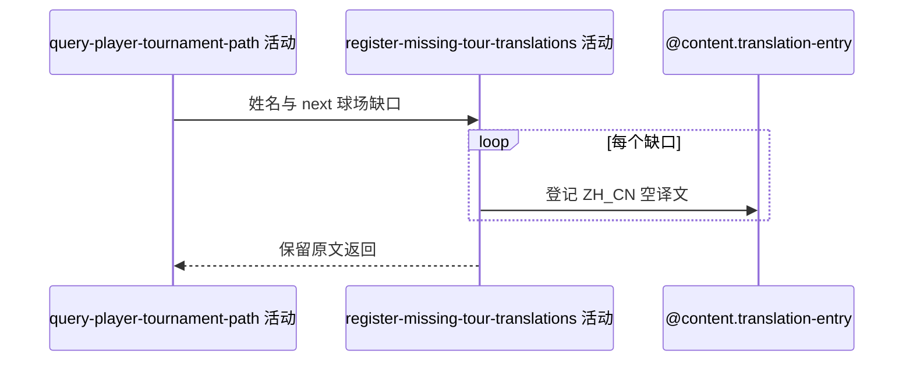

## 概要

为路径中的球员姓名和下一场球场未命中简中译文登记待翻译项。

## 时序图

## 触发条件

路径主体成功形成且主球员、对手姓名或 next 球场简中翻译未命中时执行。

## 活动契约

逐项登记 PLAYER/COURT 原文的 ZH_CN 待翻译记录；单项失败记日志并继续，签表/球员空结果时不执行。

## 异常分支

| 错误标识 | 触发条件 | 处理 |
|---|---|---|
| 单项容错 | 重复或单条保存失败 | 保留原文并继续 |
| `OPERATION_FAILED` | 翻译查询/回写未捕获异常 | 终止请求，已保存项不统一回滚 |

## 领域依赖

### @content.translation-entry

- 输入：PLAYER/COURT 类型、原文、ZH_CN
- 输出：待翻译记录或失败结论

## 业务动作

A1 去重翻译缺口
A2 逐项登记待翻译记录
A3 容错返回原文路径

## 详细流程

1. 非空译文已应用；未命中键按实体类型/原文/语言去重。
2. 尝试建立空 translated_text 记录；单项异常仅记录。
3. next 球场只为排期文本的本地化登记，原 court 字段仍保持来源值。
4. 查询无整体事务，已成功登记项不因后续失败回滚。

## 边界情况

- 无 next 时没有球场翻译键。
- 并发唯一键冲突不阻止原文展示。
- 不返回登记状态。

## 实现提示

写入通过既有 `@content.translation-entry` 表达，`reads` 为空。
