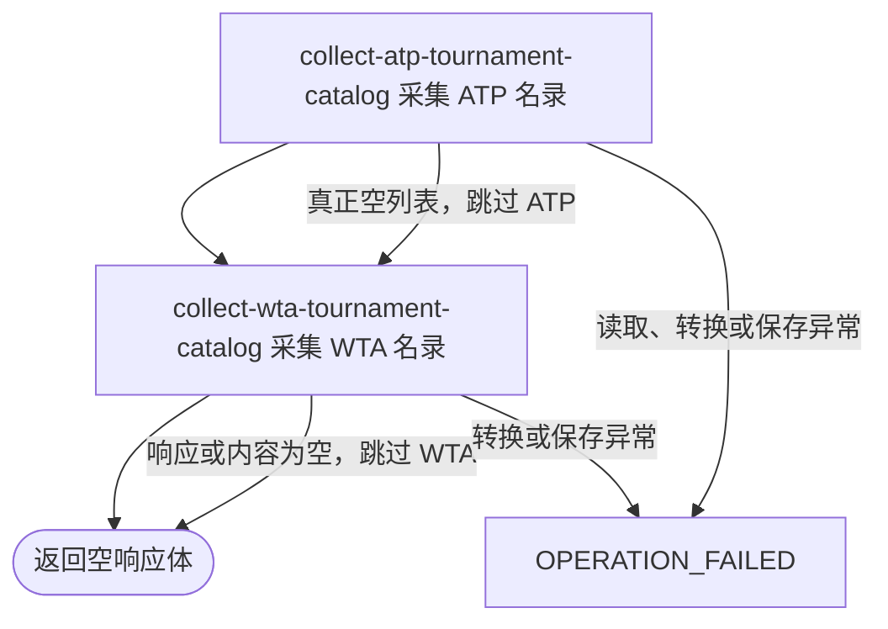

## 概要

按年份依次采集并刷新 ATP、WTA 职业赛事名录。

## 触发

运营或任意匿名调用方需要刷新某一整数年份的职业赛事基础名录时发起。每次固定先 ATP、后 WTA，不接收巡回赛、分页或采集上限参数。

## 接口契约

查询参数 `year` 必须出现并可转换为整数；不校验正负、过去或未来范围。成功返回 HTTP 空响应体，包括 ATP 真正空列表或 WTA 请求失败/空内容被跳过的情况；不返回新增、更新、跳过数量或分来源状态。

## 业务活动

- collect-atp-tournament-catalog  采集并按年度赛事身份新增或刷新 ATP 名录
- collect-wta-tournament-catalog  采集并按年度赛事身份新增或刷新 WTA 名录

## 流程图

## 详细流程

1. 接收必填整数年份 `year`。入口位于普通登录鉴权排除范围，不校验运营身份，也不限制年份区间。
2. 请求 Tennis TV API 中该年起止日期范围、最多 200 条 ATP 赛事。客户端异常被转为 `null`；`null` 随后在转换时触发异常并终止流程，真正的空列表则不保存并继续 WTA。
3. 将 ATP 赛事统一标记为 `tour=ATP`、`status=active`，映射名称、级别、场地、举办地、奖金与起止日期；日期或奖金无法解析时为 `null`。
4. 以 `(tournamentId, year)` 匹配存量赛事，在 ATP 独立事务中新增或刷新全部名录字段；刷新时保留既有主图和背景图。本次来源未出现的赛事不删除或失效。
5. 请求 WTA API 中该年起止日期范围的第 0 页、最多 1000 条并排除 ITF。响应或内容为空时跳过 WTA 并正常结束；其他未处理异常终止流程。
6. 将 WTA 赛事标记为 `tour=WTA`；`past` 映射为 `completed`，其他状态映射为 `active`；Grand Slam 级别映射 `GS`，其他级别移除 `WTA` 前缀，奖金数值缩窄为整数且展示文本保留来源数值与币种。
7. 按同一 `(tournamentId, year)` 规则在 WTA 独立事务中新增或刷新，并保留图片。ATP 已提交后 WTA 失败不回滚 ATP；接口成功时返回空响应体，不交付数量或分来源结果。

## 异常分支

| 对外失败码 | 触发条件 | 由哪个活动报出 | 补偿动作或超时处理 | 对外提示 |
|---|---|---|---|---|
| `OPERATION_FAILED` | `year` 缺失或无法转换为整数 | 流程入口参数绑定 | 未开始采集，不改变赛事名录 | 缺失参数无本入口专用提示；类型错误提示参数类型错误 |
| 无 | ATP 客户端成功返回真正的空列表 | collect-atp-tournament-catalog | 不改变 ATP，继续 WTA；不补采 | 空响应体 |
| `OPERATION_FAILED` | ATP 请求/解析异常被客户端转为 `null`，随后转换触发空指针；或 ATP 转换、保存发生异常 | collect-atp-tournament-catalog | ATP 保存异常回滚 ATP 当批；终止流程，不处理 WTA | 系统异常，请稍后重试 |
| 无 | WTA 请求/解析异常被客户端转为 `null`，或响应内容为空 | collect-wta-tournament-catalog | 跳过 WTA；已提交 ATP 保留，不补采 | 空响应体 |
| `OPERATION_FAILED` | WTA 内容转换或事务保存发生未处理异常 | collect-wta-tournament-catalog | WTA 当批回滚；已提交 ATP 不回滚 | 系统异常，请稍后重试 |

日期或 ATP 奖金无法解析时字段为 `null` 而不单独拒绝；若由此或其他缺失字段触发数据库约束，则对应巡回赛整批失败。WTA 奖金由 `long` 直接缩窄为 `int`，超出范围不会主动报错而可能溢出。

## 技术线索

- HTTP：`GET /tour/collect/tournaments?year=...`，`/tour/collect/**` 排除普通登录鉴权
- 入口：`TourCollectController.tournaments()` → `TourCollectFacade.tournaments()` → `TournamentCollectService.collectTournament()`
- ATP：`AtpTvClient.getTournaments()`；全年 `from/to`、`size=200`
- WTA：`WtaClient.getTournaments()`；`page=0`、`pageSize=1000`、`excludeLevels=ITF`
- 转换：`TournamentAppConvertMapper`、`WtaTournamentAppConvertMapper`
- 保存：`TourTournamentService.saveOrUpdateBatch()`；ATP/WTA 为两次独立事务调用
- 身份键：`tournament_id + year`，不包含 `tour`
