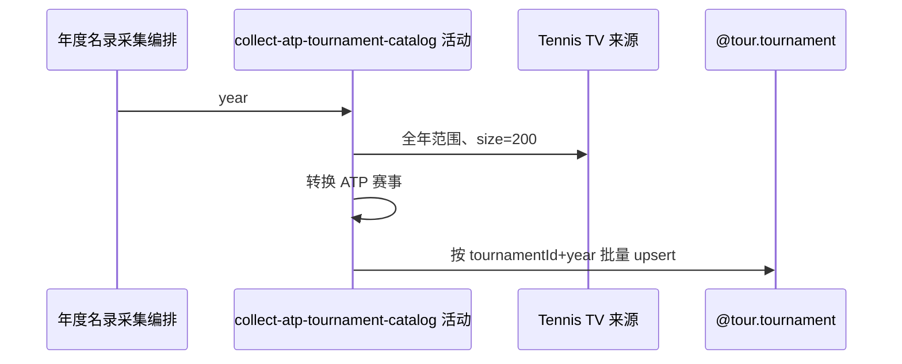

## 概要

采集指定年份 ATP 赛事名录，按赛事编号与年份新增或刷新资料。

## 时序图

## 触发条件

匿名可调用入口绑定成功任意整数 year 后首先执行。

## 活动契约

固定采集该年 ATP 最多 200 条；真正空列表跳过并继续 WTA。成功批次独立提交，不返回统计。

## 异常分支

| 错误标识 | 触发条件 | 处理 |
|---|---|---|
| 空来源跳过 | 客户端成功返回真正空列表 | 不改 ATP，继续 WTA |
| `OPERATION_FAILED` | 客户端异常转 null 后转换失败、映射或保存异常 | 回滚 ATP 当批，终止且不处理 WTA |

## 领域依赖

### @tour.tournament

- 输入：`tour=ATP`、指定 year 的来源赛事完整名录资料
- 输出：按 `(tournamentId,year)` 新增或刷新，保留图片；失败回滚

## 业务动作

A1 请求全年 ATP 赛事
A2 转换来源字段
A3 批量新增或刷新

## 详细流程

1. `A1` 以该年起止日期和 size=200 请求来源；客户端异常返回 null，后续转换会失败；真正空列表跳过。
2. `A2` 强制 tour=ATP、status=active，映射名称、category、surface、城市、国家、奖金、起止日期；日期/奖金解析失败为 null。
3. `A3` 以 tournamentId+year 匹配，新增或刷新全部名录字段；更新保留 image_path/background_path。
4. 来源本次未出现的存量赛事不删除、不失效。ATP 在独立事务提交后才进入 WTA。

## 边界情况

- 身份键不含 tour，跨来源同编号同年可能互相覆盖。
- null 必填字段可使整批数据库保存失败。
- year 不限制过去、未来或负数。

## 实现提示

写入使用既有 `@tour.tournament` 聚合，`reads` 为空；ATP TV RPC snapshot 当前缺失。
