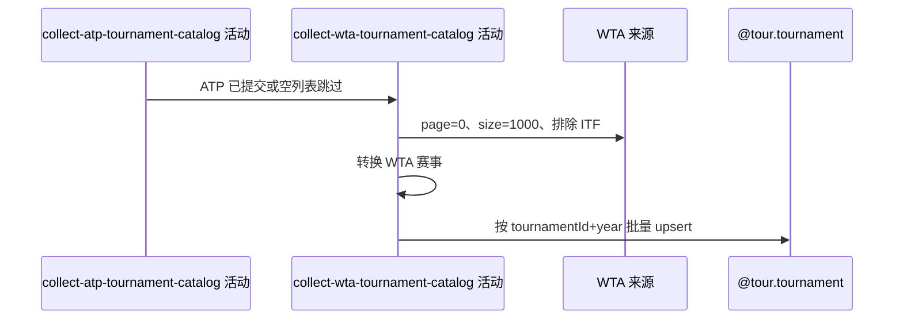

## 概要

ATP 处理后采集指定年份 WTA 赛事名录，按同一年度身份新增或刷新。

## 时序图

## 触发条件

ATP 成功提交或真正空列表跳过后执行；ATP 异常时不执行。

## 活动契约

固定采集该年 WTA 第 0 页最多 1000 条并排除 ITF；null 响应或空内容正常跳过。独立事务失败不回滚 ATP。

## 异常分支

| 错误标识 | 触发条件 | 处理 |
|---|---|---|
| 空来源跳过 | 客户端异常转 null 或响应内容为空 | 不改 WTA，整体仍成功 |
| `OPERATION_FAILED` | 内容转换或批量保存失败 | 回滚 WTA 当批，ATP 保留 |

## 领域依赖

### @tour.tournament

- 输入：`tour=WTA`、指定 year 的来源赛事资料
- 输出：按 `(tournamentId,year)` 新增或刷新，保留图片；失败回滚本批

## 业务动作

A1 请求全年 WTA 赛事
A2 转换状态、级别与奖金
A3 批量新增或刷新

## 详细流程

1. `A1` 请求 year 起止、page0/pageSize1000、exclude ITF；null/空内容跳过并正常结束。
2. `A2` 强制 tour=WTA；past→completed，其余 active；Grand Slam→GS，其他 category 去 WTA 前缀。
3. 奖金 long 直接缩窄为 int，展示文本保留来源数值和币种；其他字段按来源映射。
4. `A3` 以 tournamentId+year upsert，保留图片；未出现存量不变。WTA 独立事务，失败不回滚 ATP。
5. 成功接口返回空响应体，无数量或分来源状态。

## 边界情况

- 奖金超 int 范围可能静默溢出。
- 身份键不含 tour，可能覆盖同号 ATP 记录。
- 空来源与实际成功更新对调用方响应不可区分。

## 实现提示

写入使用 `@tour.tournament`，`reads` 为空；WTA RPC snapshot 当前缺失。
