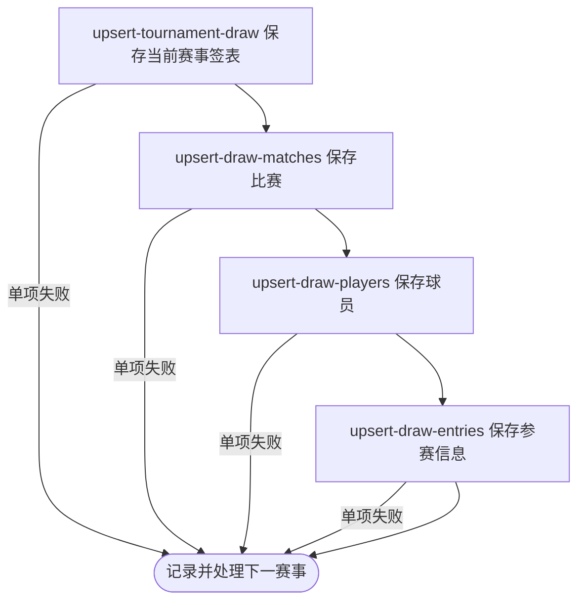

## 概要

逐项采集当前日期窗口内职业赛事的单打签表。

## 触发

运营或任意匿名调用方需要刷新运行日附近全部职业赛事签表时发起。入口无参数，按数据库赛期动态确定目标。

## 接口契约

无请求参数。成功返回纯文本 `当前签表采集完成`；没有当前赛事、单个赛事失败或全部单项都失败时也返回同一文本，不包含成功、失败、跳过数量或赛事清单。

## 业务活动

- upsert-tournament-draw  按赛事、年份和签表类型新增或刷新签表结构
- upsert-draw-matches  按签表和外部比赛编号新增或刷新比赛快照
- upsert-draw-players  按巡回赛和外部球员编号新增或刷新球员资料
- upsert-draw-entries  按签表和球员新增或刷新种子及入围信息

## 流程图

## 详细流程

1. 入口不要求登录。按运行时当地日期读取赛期与 `[昨日, 明日]` 有交集的全部本地赛事，不校验赛事状态；没有赛事时直接成功。
2. 逐项按赛事 `tour` 与 `category` 选择签表来源：ATP 大满贯用 ATP App、其他 ATP 用 Tennis TV；WTA 大满贯用 ATP App、其他 WTA 用 WTA API；所有 WTA 再尝试 ATP App 已完成赛果补充。
3. 各来源请求失败、响应为空或没有可识别签表时不产生该来源更新。当前只保存单打；双打仅在开关启用且来源转换支持时进入。
4. 对每份签表，以 `(tournamentId, year, drawType)` 新增或刷新人数与轮数，再以 `(drawId, matchId)` 新增或用非空快照字段刷新比赛；来源遗漏记录不删除，比赛状态没有方向约束。
5. 保存来源球员资料，再以 `(drawId, playerId)` 新增或用非空种子、入围方式刷新参赛信息。签表、比赛、球员和参赛保存各自提交，中途失败可留下部分新旧数据。
6. 单项赛事的巡回赛/类别错误、转换或保存异常被逐赛事捕获并记录，继续下一项；WTA 已完成赛果补充的赛事编号或年份不符时只拒绝该份补充。
7. 全部目标遍历后返回纯文本“当前签表采集完成”；即使某些或全部赛事失败也返回相同文本，不交付成功、失败或跳过明细。

## 异常分支

| 对外失败码 | 触发条件 | 由哪个活动报出 | 补偿动作或超时处理 | 对外提示 |
|---|---|---|---|---|
| 无 | 日期窗口内没有赛事 | 目标赛事读取 | 不请求来源、不产生变更 | 当前签表采集完成 |
| 无 | 单项赛事巡回赛/类别非法，或来源转换、任一保存步骤异常 | 四个保存活动或来源路由 | 记录该赛事异常并继续下一项；失败步骤回滚自身事务，此前提交保留 | 当前签表采集完成 |
| 无 | 来源为空、无可识别签表、未收录赛事或双打被排除 | 来源采集 / upsert-tournament-draw | 对应来源不更新，继续当前赛事其他来源或下一赛事 | 当前签表采集完成 |
| `OPERATION_FAILED` | 当前赛事列表读取等发生循环外未处理异常 | 目标赛事读取 | 终止请求；此前已处理赛事保留 | 系统异常，请稍后重试 |

单项异常不会在成功响应中暴露。来源遗漏对象不删除；WTA 补充赛事编号或年份不符时只跳过补充；各保存活动独立提交，不形成整批原子快照。

## 技术线索

- HTTP：`GET /tour/collect/currentDraws`，普通鉴权排除范围
- 当前范围：`start_date <= today + 1 day` 且 `end_date >= today - 1 day`，不筛状态
- 入口：`TourCollectController.collectCurrentDraws()` → `TourCollectFacade.currentDraws()`
- 路由与编排：`TourCollectFacade.draws()`、`MatchCollectManager.collect()`
- 保存：`DrawCollectService`、`MatchCollectService`、`PlayerCollectService`、`TournamentCollectService.saveEntries()`
