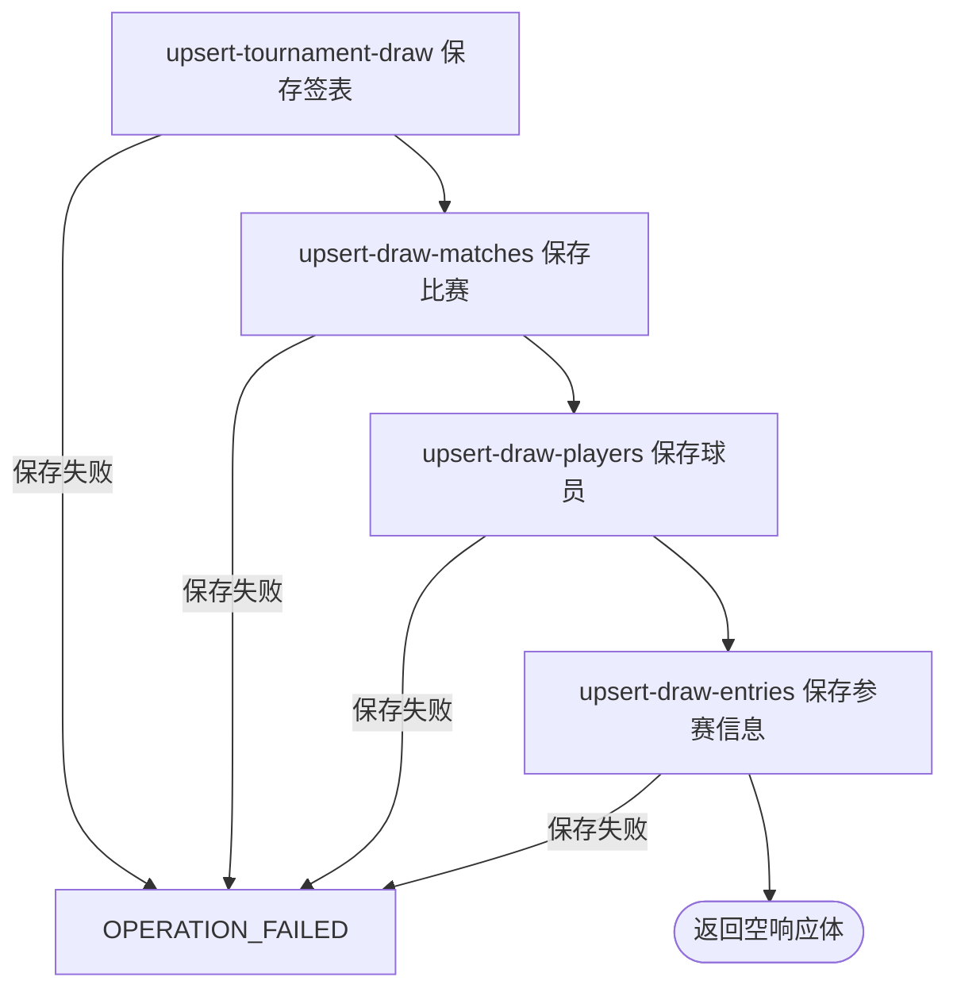

## 概要

按外部赛事编号采集一项已收录职业赛事的单打签表。

## 触发

运营或任意匿名调用方需要立即刷新某个外部赛事编号对应的签表时发起。该入口只取本地同编号第一条赛事，不允许指定年份。

## 接口契约

查询参数 `tournamentId` 必须出现，原样查询且不裁剪。成功返回 HTTP 空响应体，不包含签表数、比赛数、球员数或部分结果。赛事不存在、巡回赛/类别无法路由或保存失败时请求失败。

## 业务活动

- upsert-tournament-draw  按赛事、年份和签表类型新增或刷新签表结构
- upsert-draw-matches  按签表和外部比赛编号新增或刷新比赛快照
- upsert-draw-players  按巡回赛和外部球员编号新增或刷新球员资料
- upsert-draw-entries  按签表和球员新增或刷新种子及入围信息

## 流程图

## 详细流程

1. 接收必填 `tournamentId`，入口不要求登录。只按该外部编号读取第一条本地赛事，不指定年份；不存在时后续解引用失败，整个请求终止。
2. 按赛事的 `tour` 与 `category` 选择来源：ATP 大满贯用 ATP App 签表，其他 ATP 用 Tennis TV；WTA 大满贯用 ATP App，其他 WTA 用 WTA API；所有 WTA 随后再用 ATP App 已完成赛果补充。未知巡回赛或空类别使请求失败。
3. 各来源请求失败、响应为空或没有可识别签表时不产生该来源更新。当前只保存单打；双打仅在开关启用且来源转换支持时进入。
4. 对每份签表，先确认外部赛事编号已在本地存在，再以 `(tournamentId, year, drawType)` 新增签表或用非空人数、轮数刷新存量。
5. 将比赛关联到签表，以 `(drawId, matchId)` 新增或刷新；来源非空字段覆盖存量，状态可直接前进或回退，来源遗漏比赛不删除。比赛关键身份缺失或保存异常会终止该签表后续处理，但此前签表变更可保留。
6. 保存来源球员资料，再以 `(drawId, playerId)` 新增或用非空种子、入围方式刷新参赛信息；各保存步骤没有覆盖整条采集的统一事务，中途失败保留此前已提交数据。
7. WTA 主签表来源成功后继续尝试已完成赛果补充；补充响应中的赛事编号或年份与目标不一致时拒绝该份补充。所有选择的来源处理完毕后返回 HTTP 空响应体，不交付统计。

## 异常分支

| 对外失败码 | 触发条件 | 由哪个活动报出 | 补偿动作或超时处理 | 对外提示 |
|---|---|---|---|---|
| `OPERATION_FAILED` | `tournamentId` 缺失，或本地没有该编号赛事 | 入口 / 来源路由前置读取 | 不开始保存 | 系统异常，请稍后重试 |
| `OPERATION_FAILED` | 赛事 `tour` 不是 ATP/WTA，或 `category` 为空 | 来源路由 | 不处理该赛事 | 系统异常，请稍后重试 |
| 无 | 来源请求失败、响应为空、没有可识别签表、签表属于未收录赛事或被双打开关排除 | 来源采集 / upsert-tournament-draw | 对应来源不产生更新；已完成来源保留 | 空响应体 |
| `OPERATION_FAILED` | 比赛缺少赛事编号、年份或比赛编号，或任一保存步骤异常 | upsert-tournament-draw / upsert-draw-matches / upsert-draw-players / upsert-draw-entries | 失败步骤自身事务回滚；此前步骤及此前来源已提交数据保留，不补偿 | 系统异常，请稍后重试 |

WTA 已完成赛果补充的赛事编号或年份与目标不符时只拒绝补充结果，主签表已提交数据保留。来源未出现的签表、比赛、球员与参赛资料不会删除或失效。

## 技术线索

- HTTP：`GET /tour/collect/draws?tournamentId=...`，`/tour/collect/**` 排除普通登录鉴权
- 入口：`TourCollectController.draw()` → `TourCollectFacade.draws(String)` / `draws(TournamentData)`
- 路由：`TourEnums`、`CollectType.ATP_DRAW` / `ATP_APP_DRAW` / `WTA_DRAW` / `ATP_APP_COMPLETED`
- 编排：`MatchCollectManager.collect()`
- 保存：`DrawCollectService`、`MatchCollectService`、`PlayerCollectService`、`TournamentCollectService.saveEntries()`
- 双打开关：`tour.collect.doubles`，默认 `false`
