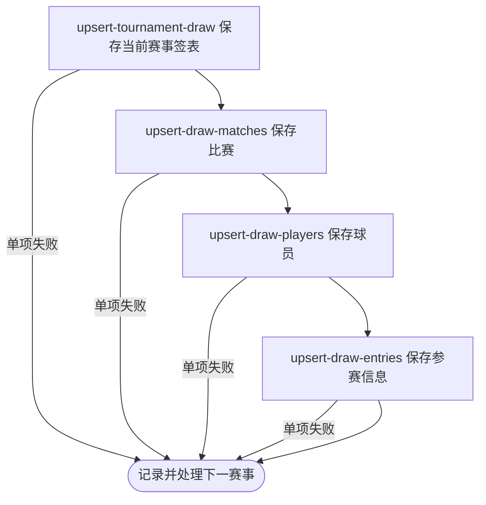

## 概要

每小时逐项采集当前日期窗口内职业赛事的单打签表。

## 触发

统一职业比赛采集任务仅在 `job.tour.enabled=true` 时装配，每五分钟由生产 cron 唤醒；DRAW 阶段再以绝对分钟整除 60 为门槛，因此每 60 分钟执行一次。调度声明未指定时区。

## 接口契约

无请求参数和对外响应。目标范围为赛期与运行日 `[昨日, 明日]` 相交的全部本地赛事，不按状态过滤；任务不交付数量、失败对象或完整性结果。

## 业务活动

- upsert-tournament-draw  按赛事、年份和签表类型新增或刷新签表结构
- upsert-draw-matches  按签表和外部比赛编号新增或刷新比赛快照
- upsert-draw-players  按巡回赛和外部球员编号新增或刷新球员资料
- upsert-draw-entries  按签表和球员新增或刷新种子及入围信息

## 流程图

## 详细流程

1. 仅在 `job.tour.enabled=true` 时装配统一比赛采集任务；任务按 `0 */5 * * * ?` 触发且未指定时区。DRAW 阶段仅在绝对分钟数可被 60 整除时执行，即每 60 分钟一次。
2. 按运行时当地日期读取赛期与 `[昨日, 明日]` 有交集的全部本地赛事，不校验状态；没有赛事时静默结束。
3. 逐项按赛事 `tour` 与 `category` 选择签表来源：ATP 大满贯用 ATP App、其他 ATP 用 Tennis TV；WTA 大满贯用 ATP App、其他 WTA 用 WTA API；所有 WTA 再尝试 ATP App 已完成赛果补充。
4. 来源为空时不更新；对可识别单打签表依次保存签表、比赛、球员和参赛信息。存量记录只被来源非空字段刷新，来源遗漏记录不删除，比赛状态可直接前进或回退。
5. 签表、比赛、球员和参赛步骤不共享整条采集事务，中途失败保留此前提交；WTA 补充数据的赛事编号或年份不符时拒绝该份补充。
6. 单项赛事异常由当前赛事循环捕获并记录，继续其他赛事；当前赛事列表读取等阶段级异常由统一任务捕获。任务不产生业务响应、统计、重试或补偿，等待后续调度再次运行。

## 异常分支

| 对外失败码 | 触发条件 | 由哪个活动报出 | 补偿动作或超时处理 | 对外提示 |
|---|---|---|---|---|
| 无 | DRAW 频率门槛未命中或没有当前赛事 | 调度 / 目标赛事读取 | 本轮不执行活动或不请求来源，等待后续调度 | 无 |
| 无 | 单项赛事路由、转换或任一保存步骤异常 | 四个保存活动或来源路由 | 当前赛事循环记录异常并继续下一项；此前提交保留 | 无 |
| 无 | 当前赛事列表读取等阶段级异常 | 目标赛事读取 | `TourCollectJob` 记录 DRAW 阶段失败并结束；不即时重试 | 无 |
| 无 | 来源为空、无可识别签表、未收录赛事或双打被排除 | 来源采集 / upsert-tournament-draw | 对应来源不更新，继续后续处理 | 无 |

任务没有跨活动、跨来源或跨赛事事务，也没有业务重试、补偿和完整性标记；失败对象只能从日志识别，下一次尝试依赖后续调度。

## 技术线索

- 任务：`TourCollectJob.matches()`；装配条件 `job.tour.enabled=true`
- 底层 cron：`job.tour.collect.live.cron`，生产值 `0 */5 * * * ?`，未指定 `zone`
- DRAW 门槛：`CollectType.Phase.DRAW(60).shouldRun(epochMinute)`
- 目标范围：`start_date <= today + 1 day` 且 `end_date >= today - 1 day`
- 调用：`TourCollectFacade.matches(DRAW)` → `currentDraws()` → `draws()` → `MatchCollectManager.collect()`
- 保存：`DrawCollectService`、`MatchCollectService`、`PlayerCollectService`、`TournamentCollectService.saveEntries()`
