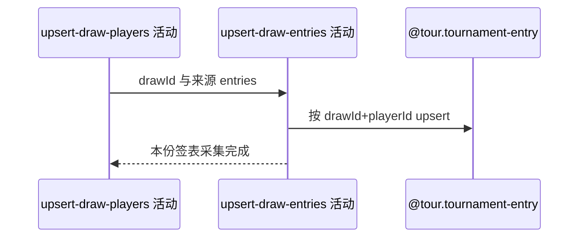

## 概要

按签表与球员新增或用非空种子、入围方式刷新参赛信息。

## 时序图

## 触发条件

签表球员保存成功后执行；来源无参赛项时可空操作。

## 活动契约

输入 drawId、playerId、种子及 entryType；按复合身份新增或非空刷新。成功完成该来源签表处理，不返回统计。

## 异常分支

| 错误标识 | 触发条件 | 处理 |
|---|---|---|
| 单项失败/`OPERATION_FAILED` | 身份、转换或保存失败 | 回滚参赛步骤；前三步已提交数据保留 |

## 领域依赖

### @tour.tournament-entry

- 输入：drawId、playerId、可选 seed/entryType
- 输出：新增或非空刷新参赛信息，失败回滚本步骤

## 业务动作

A1 关联签表与球员
A2 按复合身份定位参赛项
A3 新增或刷新种子入围信息

## 详细流程

1. 将来源参赛信息关联已保存 drawId 和 playerId。
2. 按 `(drawId,playerId)` 定位；无记录新增，有记录仅用非空 seed/entryType 刷新。
3. 来源遗漏的旧参赛记录不删除、不标记退出。
4. 独立事务提交；失败不补偿已经提交的签表、比赛与球员。
5. 批量当前赛事入口单项异常被捕获后继续下一赛事；单项入口则请求失败。

## 边界情况

- seed 为 null 或 0 的来源不会用于种子查询展示，但记录可存在。
- 一个球员在不同 draw 可各有参赛记录。
- 无跨四步完整性标记或补偿。

## 实现提示

写入使用新登记 `@tour.tournament-entry`，`reads` 为空；四步各自提交。
