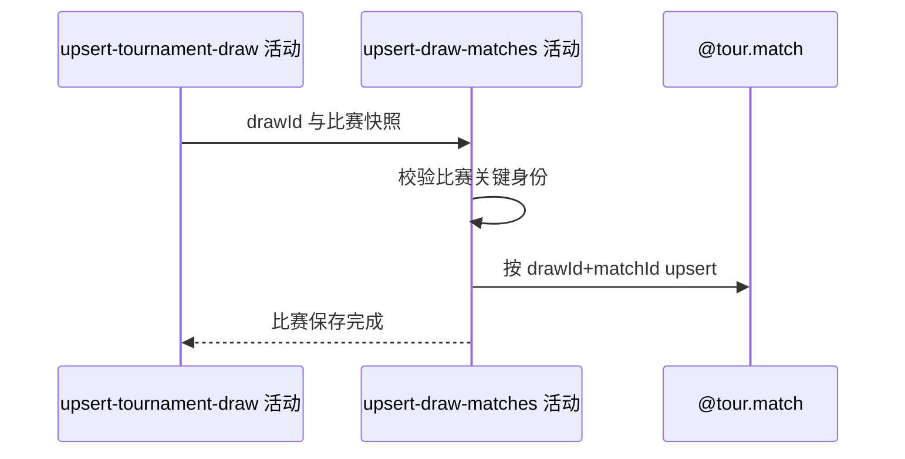

## 概要

把来源比赛关联已保存签表，按签表与比赛编号新增或非空刷新快照。

## 时序图

## 触发条件

签表已取得内部 drawId 后执行；来源无比赛时可空操作。

## 活动契约

输入 drawId 和来源比赛集合；按 `(drawId,matchId)` 新增或以来源非空字段刷新完整快照，状态允许前进或回退。

## 异常分支

| 错误标识 | 触发条件 | 处理 |
|---|---|---|
| 单项失败/`OPERATION_FAILED` | 缺赛事编号、年份、matchId，转换或保存失败 | 回滚比赛步骤；已提交签表保留 |

## 领域依赖

### @tour.match

- 输入：drawId、外部比赛身份及来源快照
- 输出：新增或非空覆盖比赛，失败回滚本步骤

## 业务动作

A1 关联签表并校验身份
A2 定位存量比赛
A3 新增或非空覆盖快照

## 详细流程

1. `A1` 把每场来源比赛绑定前一活动 drawId；关键赛事编号、year、matchId 缺失时失败。
2. `A2-A3` 按 drawId+matchId upsert，来源非空字段覆盖存量，包括状态、时间、球场、双方和比分快照。
3. 不执行状态单向约束，较旧来源可把状态回退；来源遗漏比赛不删除。
4. 比赛批次独立事务，失败不补偿已提交签表；成功后才保存球员。

## 边界情况

- 不同 draw 中同 matchId 可各有一条。
- 空或 null 来源字段保留存量值。
- WTA 完赛补充可在主签表之后再次刷新相同比赛。

## 实现提示

写入使用 `@tour.match`，`reads` 为空；各采集活动不是统一原子快照。
