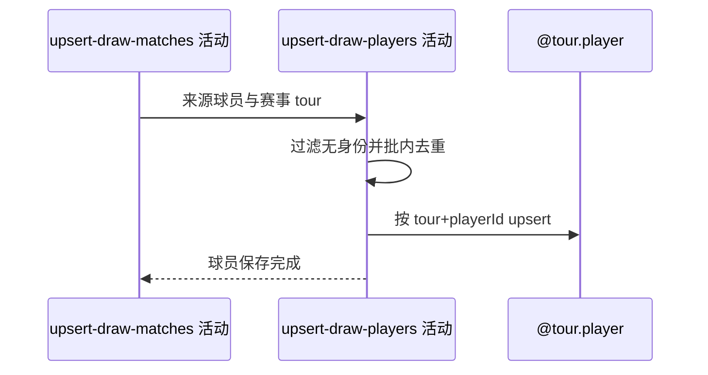

## 概要

按巡回赛与外部球员编号新增或用来源非空字段刷新签表球员资料。

## 时序图

## 触发条件

来源签表比赛保存成功后，存在来源球员资料时执行。

## 活动契约

输入来源球员与目标赛事 tour；过滤无身份记录，按 `(tour,playerId)` 新增或非空覆盖。来源未出现存量不变。

## 异常分支

| 错误标识 | 触发条件 | 处理 |
|---|---|---|
| 单项失败/`OPERATION_FAILED` | 转换、存量查询或批量保存失败 | 回滚球员步骤；签表和比赛保留 |

## 领域依赖

### @tour.player

- 输入：赛事巡回赛与外部球员资料
- 输出：按复合身份新增或非空刷新球员，失败回滚本批

## 业务动作

A1 强制/继承巡回赛身份
A2 过滤并批内去重
A3 新增或非空覆盖

## 详细流程

1. 把来源球员关联目标赛事 tour，过滤 playerId 或 tour 为空记录。
2. 以 tour+playerId 批内去重并查存量；未收录新增，已有只用非空来源字段覆盖。
3. 本次来源未出现的存量球员不删除、不清空资料。
4. 独立事务失败不回滚已提交签表/比赛；成功后进入参赛信息保存。

## 边界情况

- 同 playerId 在 ATP/WTA 可为两条；查询端有些入口仅按 playerId 会产生歧义。
- 新球员缺表必填姓名可能整批失败。
- 空来源字段不擦除旧值。

## 实现提示

复用已登记 `@tour.player`，`reads` 为空。
