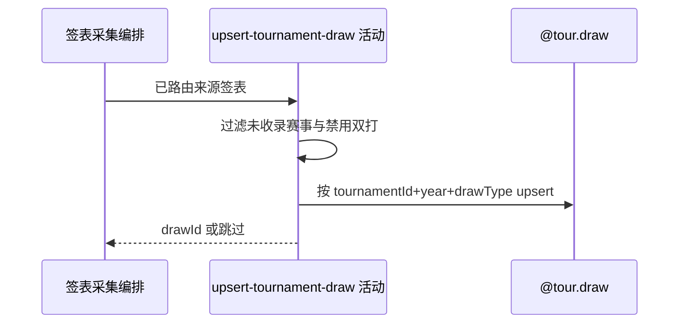

## 概要

对可识别来源签表按赛事、年份与类型新增或刷新结构。

## 时序图

## 触发条件

来源路由得到一份可识别签表后执行；空响应或无签表不执行写入。

## 活动契约

输入赛事编号、年份、drawType、人数和轮数；确认赛事本地已收录且类型允许后 upsert，输出内部 drawId 供后续步骤。

## 异常分支

| 错误标识 | 触发条件 | 处理 |
|---|---|---|
| 跳过 | 来源空、赛事未收录、无可识别签表或双打禁用 | 不更新该份来源 |
| 单项失败/`OPERATION_FAILED` | 转换、身份或保存异常 | 回滚本活动；批量入口记日志继续赛事，单项入口终止 |

## 领域依赖

### @tour.draw

- 输入：赛事、年份、签表类型及可选 size/totalRounds
- 输出：新增或非空刷新后的 drawId，或跳过/失败

## 业务动作

A1 校验来源签表可保存
A2 按复合身份定位签表
A3 新增或刷新结构

## 详细流程

1. 采集目标由外层按 tour/category 路由；来源请求失败、空或无签表时跳过。
2. 当前默认仅保存单打；双打须开关启用且转换支持。外部赛事编号必须已存在本地名录。
3. `A2-A3` 按 `(tournamentId,year,drawType)` 新增，或以非空 size/totalRounds 刷新存量。
4. 来源遗漏的既有签表不删除、不失效；本活动独立提交后才进入比赛保存。

## 边界情况

- 单项入口只按 tournamentId 取本地第一条赛事，无法指定年份。
- 当前赛事批量范围为赛期与昨日/明日窗口相交，不筛状态。
- WTA 补充编号或年份不符时整份补充跳过。

## 实现提示

写入使用新登记 `@tour.draw` 聚合，`reads` 为空；外部 RPC snapshots 当前缺失。
