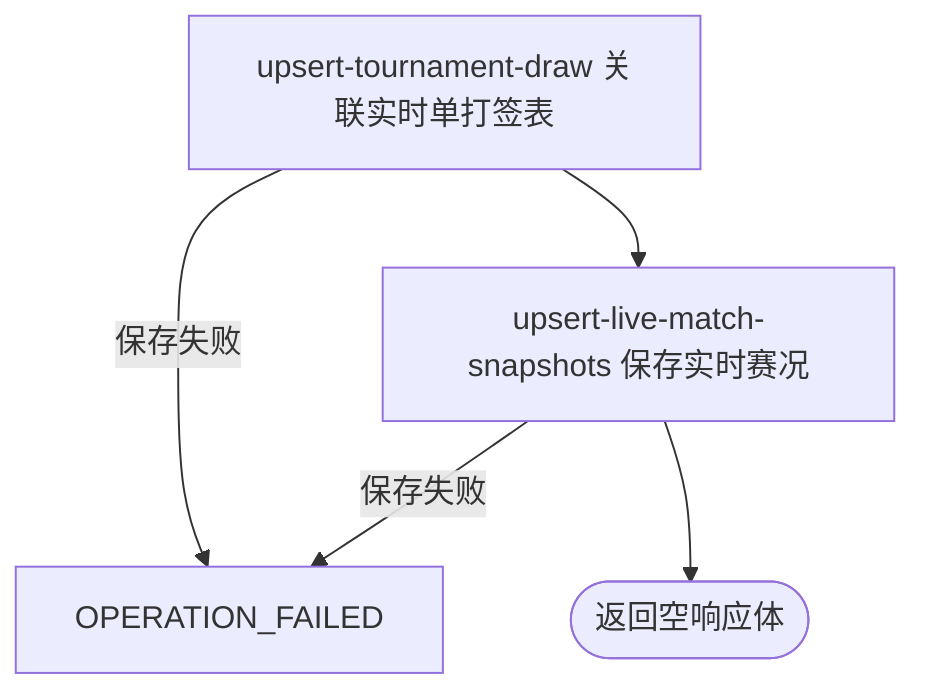

## 概要

手动刷新当前职业赛事的单打实时赛况与比分。

## 触发

运营或任意匿名调用方需要立即刷新运行日附近职业赛事的实时单打赛况时发起。入口无参数，目标由本地赛事赛期决定。

## 接口契约

无请求参数。成功返回 HTTP 空响应体；没有当前赛事、某赛事来源为空或错赛数据被拒绝时不另行提示，也不返回新增、更新、跳过或分赛事结果。

## 业务活动

- upsert-tournament-draw  为实时比赛关联或新增单打签表
- upsert-live-match-snapshots  按签表和比赛编号新增或刷新实时赛况快照

## 流程图

## 详细流程

1. 接收无参数 HTTP 请求，入口不要求登录。按运行时当地日期读取赛期与 `[昨日, 明日]` 相交的全部本地赛事，不按状态筛选；没有赛事时返回空响应体。
2. 按每项赛事编号、年份和巡回赛从 ATP Tour App 实时接口取数；ATP 只保留 `MS` 前缀比赛，WTA 只保留 `LS` 前缀。巡回赛不是 ATP/WTA 时抛错并终止后续赛事。
3. 来源无响应、空数据或没有对应单打比赛时跳过该赛事；来源赛事编号或年份与目标不符时丢弃整批。无法解析的未处理异常终止本次调用。
4. 将双方、胜方、场地、状态和盘分形成快照。状态 `S/Scheduled/U`→`PENDING`、`C`→`COMING`、`P`→`LIVE`、`F/Completed`→`FINISHED`，未知状态为 `null`；盘分以第一方有效盘为基准。
5. 以 `(tournamentId, year, drawType)` 关联或新增单打签表，不刷新人数与总轮数；再以 `(drawId, matchId)` 新增比赛或用来源非空字段覆盖存量，状态不校验前进方向，来源遗漏比赛不删除。
6. 每项签表保存与比赛批量保存分别提交；比赛保存失败可留下新签表。任一赛事的转换或保存异常会终止循环，已处理赛事保留、后续赛事不再处理。成功以 HTTP 空响应体结束，无统计。

## 异常分支

| 对外失败码 | 触发条件 | 由哪个活动报出 | 补偿动作或超时处理 | 对外提示 |
|---|---|---|---|---|
| 无 | 日期窗口内没有赛事 | 目标赛事读取 | 不请求来源、不产生变更 | 空响应体 |
| 无 | 来源无响应、数据为空、没有对应 `MS`/`LS`，或响应赛事编号/年份不符 | 来源采集 | 该赛事不更新，继续下一项 | 空响应体 |
| `OPERATION_FAILED` | 当前赛事 `tour` 不是 ATP/WTA，来源 JSON 无法解析，或签表/比赛保存异常 | upsert-tournament-draw / upsert-live-match-snapshots | 终止后续赛事；失败事务回滚，此前赛事保留；比赛失败时已新增签表不回滚 | 系统异常，请稍后重试 |
| `OPERATION_FAILED` | 比赛缺少赛事编号、年份或比赛编号，或身份字段与存量冲突 | upsert-live-match-snapshots | 整个比赛批次回滚；已保存签表与此前赛事保留 | 系统异常，请稍后重试 |

未知来源状态和无有效盘分都以 `null` 进入合并，因此不会清空存量状态或比分；新比赛相应字段可为空。来源缺少或更正为空的胜方、场地、对阵与比分不会清除旧值。

## 技术线索

- HTTP：`GET /tour/collect/live`，普通登录鉴权排除范围
- 入口：`TourCollectController.live()` → `TourCollectFacade.liveMatch()`
- 当前范围：`TourTournamentService.findCurrentTournaments(LocalDate.now())`
- 来源与转换：`CollectType.ATP_APP_LIVE`、`AtpAppLiveMatchCollectClient`
- 状态：`MatchStatus.toStatus()`；单打前缀 ATP=`MS`、WTA=`LS`
- 保存：`MatchCollectManager.collect()` → `DrawCollectService.saveOrUpdate()` / `MatchCollectService.saveMatches()`
