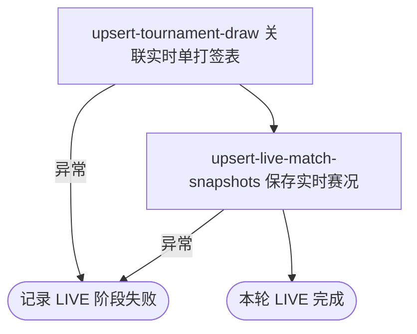

## 概要

每五分钟刷新当前职业赛事的单打实时赛况与比分。

## 触发

统一职业比赛采集任务启用后，每五分钟触发 LIVE 阶段。该阶段先于同轮 OOP、DRAW 执行；调度表达式未指定时区。

## 接口契约

无请求参数和对外响应。每轮目标为赛期与运行日 `[昨日, 明日]` 相交的全部本地赛事，不按状态过滤；不交付数量、失败对象或完整性结果。

## 业务活动

- upsert-tournament-draw  为实时比赛关联或新增单打签表
- upsert-live-match-snapshots  按签表和比赛编号新增或刷新实时赛况快照

## 流程图

## 详细流程

1. 仅在 `job.tour.enabled=true` 时装配统一比赛采集任务，按生产配置 `0 */5 * * * ?` 触发；LIVE 阶段每次都执行。调度声明未指定时区。
2. 按运行时当地日期读取赛期与 `[昨日, 明日]` 相交的全部本地赛事，不按状态筛选；没有赛事时静默结束。
3. 逐项从 ATP Tour App 实时接口取数；ATP 只保留 `MS` 前缀，WTA 只保留 `LS` 前缀。空来源或赛事编号/年份不匹配时跳过该赛事。
4. 映射对阵、胜方、场地、状态与有效盘分，以赛事、年份和单打类型关联或新增签表，再按签表与比赛编号新增或以非空字段刷新比赛；来源遗漏不删除，状态可回退。
5. 签表与比赛保存不共享事务；比赛失败可留下新签表。任一赛事未处理异常会终止后续赛事，并由统一任务捕获记录 LIVE 阶段失败。
6. 任务不产生业务响应、统计、失败对象、即时重试或补偿；已提交赛事保留，下一次尝试依赖后续五分钟调度。

## 异常分支

| 对外失败码 | 触发条件 | 由哪个活动报出 | 补偿动作或超时处理 | 对外提示 |
|---|---|---|---|---|
| 无 | 没有当前赛事 | 目标赛事读取 | 静默结束 LIVE，后续阶段仍可执行 | 无 |
| 无 | 来源为空、没有目标单打或赛事编号/年份不符 | 来源采集 | 当前赛事不更新，继续下一赛事 | 无 |
| 无 | 非 ATP/WTA、来源解析、签表或比赛保存发生未处理异常 | upsert-tournament-draw / upsert-live-match-snapshots | 终止后续赛事，记录 LIVE 阶段失败；此前提交保留，同轮仍继续 OOP/DRAW | 无 |
| 无 | 比赛关键身份缺失或与存量冲突 | upsert-live-match-snapshots | 比赛批次回滚，已新增签表保留；等待后续调度，无即时重试 | 无 |

任务没有跨赛事或签表/比赛总事务，也没有业务补偿与失败对象清单。未知状态、无有效盘分和其他空字段不会清空存量，比赛状态可被非空旧/新快照任意覆盖。

## 技术线索

- 任务：`TourCollectJob.matches()`；装配条件 `job.tour.enabled=true`
- cron：`job.tour.collect.live.cron`，生产值 `0 */5 * * * ?`，未指定 `zone`
- 阶段：`CollectType.Phase.LIVE(5)`，统一循环顺序 LIVE → OOP → DRAW
- 调用：`TourCollectFacade.matches(LIVE)` → `liveMatch()` → `MatchCollectManager.collect(ATP_APP_LIVE)`
- 来源与转换：`AtpAppLiveMatchCollectClient`
- 保存：`DrawCollectService.saveOrUpdate()` / `MatchCollectService.saveMatches()`
