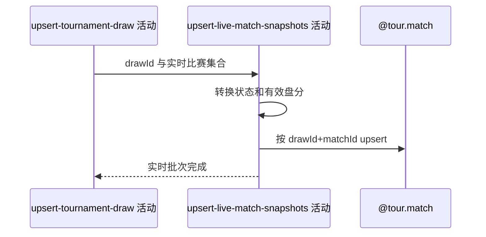

## 概要

按签表与比赛编号新增或非空刷新实时对阵、状态、球场、胜方和盘分快照。

## 时序图

## 触发条件

实时单打签表已取得 drawId 后执行。

## 活动契约

输入实时比赛集合；按 `(drawId,matchId)` 新增或以非空字段覆盖存量。未知状态/无有效盘分为 null，不清空旧值。

## 异常分支

| 错误标识 | 触发条件 | 处理 |
|---|---|---|
| `OPERATION_FAILED`/调度记录 | 关键身份缺失、转换、冲突或批量保存失败 | 回滚比赛批次；签表和此前赛事保留，终止后续赛事 |

## 领域依赖

### @tour.match

- 输入：drawId、matchId 与实时非空快照字段
- 输出：新增或非空刷新比赛，失败回滚批次

## 业务动作

A1 转换实时状态与盘分
A2 校验比赛身份
A3 新增或非空覆盖快照

## 详细流程

1. `A1` 状态 S/Scheduled/U→PENDING、C→COMING、P→LIVE、F/Completed→FINISHED，未知为 null；盘分以第一方有效盘为基准。
2. 映射双方、winner、court、状态和 sets；缺赛事编号、year 或 matchId 时批次失败。
3. `A3` 按 drawId+matchId upsert，只有非空来源字段覆盖，状态没有前进约束；来源遗漏比赛不删除。
4. 未知状态、无有效盘分及来源更正为空不会清空存量；新比赛相应字段可为空。
5. 比赛独立事务，失败不回滚前置签表；成功后手动返回空体，定时无响应。

## 边界情况

- 非空旧/新快照都可使状态回退。
- 一个赛事失败会停止循环，定时同轮仍由外层继续 OOP/DRAW 阶段。
- 下一次修复依赖后续五分钟调度，无即时重试。

## 实现提示

写入使用 `@tour.match`，`reads` 为空；签表与比赛不是原子提交。
