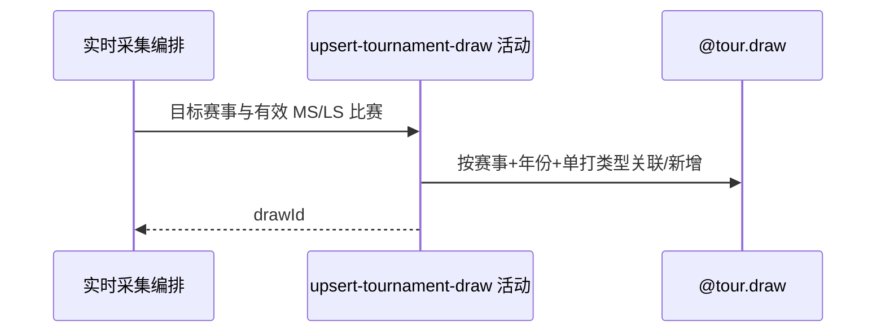

## 概要

为一批有效实时单打比赛关联或新增对应赛事签表。

## 时序图

## 触发条件

当前赛事的 ATP App 响应非空、编号年份匹配且存在目标单打比赛时执行。

## 活动契约

输入目标赛事、year 与单打 drawType；按复合身份取得或新增签表，不刷新 size/totalRounds，输出 drawId。

## 异常分支

| 错误标识 | 触发条件 | 处理 |
|---|---|---|
| 跳过 | 来源空、无 ATP MS/WTA LS、编号或年份不匹配 | 不写签表，继续下一赛事 |
| `OPERATION_FAILED`/调度记录 | tour 非 ATP/WTA、转换或保存失败 | 回滚本步骤并终止后续赛事；此前赛事保留 |

## 领域依赖

### @tour.draw

- 输入：赛事编号、年份、对应单打类型
- 输出：关联或新增 drawId，结构字段不刷新

## 业务动作

A1 校验实时来源目标
A2 选择 ATP MS 或 WTA LS
A3 关联或新增单打签表

## 详细流程

1. 目标是赛期与 `[昨日,明日]` 相交的本地赛事，不筛状态；ATP 取 MS 前缀，WTA 取 LS，其他 tour 失败。
2. 来源赛事编号/year 不等于目标时丢弃整批，空来源或无目标比赛跳过。
3. 按 `(tournamentId,year,drawType)` 取得或新增签表，实时来源不写 size/totalRounds。
4. 签表事务独立提交，之后才保存比赛；比赛失败可留下新签表。

## 边界情况

- 无当前赛事时手动空响应、定时静默。
- 单项异常终止后续赛事，不像 currentDraws 逐赛事容错。
- 手动入口匿名可用。

## 实现提示

写入使用 `@tour.draw`，`reads` 为空；ATP App Live RPC snapshot 当前缺失。
