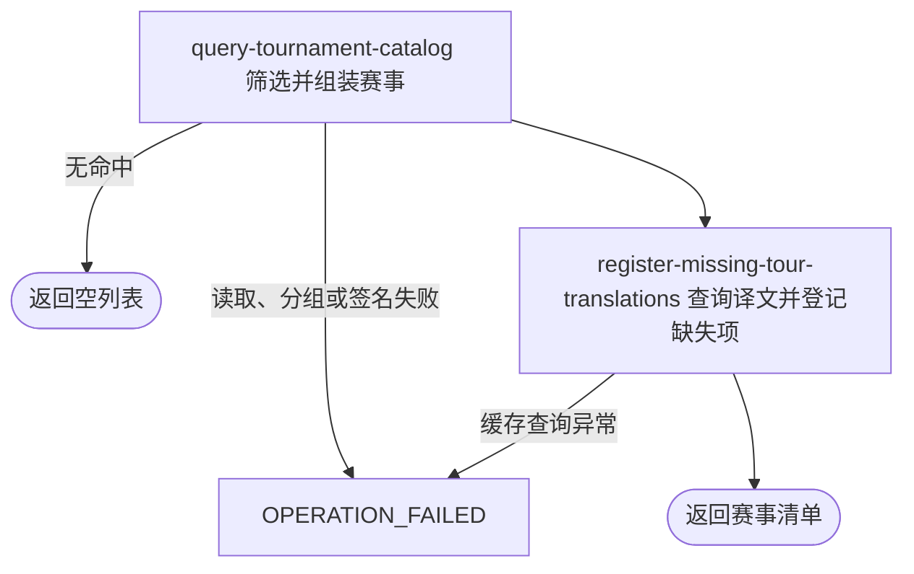

## 概要

按可选状态、巡回赛与日期范围交付职业赛事展示清单。

## 触发

用户或匿名访问者需要浏览符合可选展示条件的职业赛事时发起。接口一次返回全部命中赛事，不分页。

## 接口契约

查询参数 `status`、`type`、`range` 均可省略。`status` 区分大小写且只识别 `FINISHED`、`ONGOING`、`UPCOMING`；`type` 原样精确匹配；`range` 不区分大小写且只识别 `recent`、`live`。未知值按详细流程不限制相应维度。

成功返回赛事数组，每项含 `id`、名称、巡回赛及标签、类别、场地表面及标签、城市、起止日期、展示状态及标签、临时 `groupId` 和背景图地址；不返回年份。无命中返回空数组。

## 业务活动

- query-tournament-catalog  筛选、分组并组装职业赛事展示清单
- register-missing-tour-translations  为简中缓存未命中的赛事、城市与场地表面登记待翻译项

## 流程图

## 详细流程

1. 接收可选 `status`、`type`、`range`，入口不要求登录。`status` 仅精确识别大写 `FINISHED`→存储 `completed`、`ONGOING/UPCOMING`→`active`，其他值不筛状态；`type` 原样精确筛选。
2. `range` 不区分大小写：`recent` 取查询当日前后各一个月的赛期交集；`live` 强制存储状态 `active` 且赛期覆盖当日；其他值不筛日期。数据库结果按开始日升序且不分页。
3. 排除可解析为整数且小于 250 的 `category`；类别空白、非数字或至少 250 时保留。无结果则返回空列表，不登记待译项。
4. 依查询顺序建立展示组：新赛事只与每组首项比较，原始城市不区分大小写且两者赛期相交时归组；空城市视为空字符串，但任一赛期端点为空都不与已有组匹配。组内按开始日升序，空开始日最后。
5. 按结果当前长度生成临时 `g<n>` 组号。每项仅以外部赛事编号为 `id`，不返回年份；根据查询当日与赛期推导 `FINISHED`、`UPCOMING` 或 `ONGOING`，缺少端点时默认可能为进行中。
6. 将场地表面代码转大写并保留原表面作展示名；ATP/WTA 类型标签原样，其他类型也原样。背景图键非空时生成 3600 秒签名地址，不验证对象存在。
7. 批量查询赛事名、城市和表面展示名的简中译文；命中则替换，未命中保留原文并逐条尝试登记待翻译项。返回全部分组赛事，不修改赛事资料。

## 异常分支

| 对外失败码 | 触发条件 | 由哪个活动报出 | 补偿动作或超时处理 | 对外提示 |
|---|---|---|---|---|
| 无 | 没有赛事命中，或全部被数字类别门槛排除 | query-tournament-catalog | 返回空列表，不生成签名、不登记待译项 | 查询成功 |
| 无 | `status`、`range` 为未知值 | query-tournament-catalog | 不限制相应筛选维度；其他条件继续生效 | 查询成功 |
| 无 | `type` 不存在 | query-tournament-catalog | 精确查询得到空列表 | 查询成功 |
| `OPERATION_FAILED` | 赛事读取、分组、DTO 组装、日期格式化或背景图签名发生未处理异常 | query-tournament-catalog | 终止整体，不返回部分列表；赛事资料不变 | 系统异常，请稍后重试 |
| `OPERATION_FAILED` | 翻译缓存查询发生未处理异常 | register-missing-tour-translations | 终止整体；此前成功登记的待译项不回滚 | 系统异常，请稍后重试 |

背景图键为空时 `backgroundUrl=null`。单条待译记录保存失败只记录日志，保留原文并继续返回清单；已登记记录不与查询共享事务。

## 技术线索

- HTTP：`GET /tour/tournament/tournaments?status=...&type=...&range=...`，普通鉴权排除范围
- 入口：`TourQueryController.tournaments()` → `TournamentQueryService.queryTournaments()`
- 查询：`TourTournamentService.listByCondition()`，按 `start_date ASC`
- 类别：`isCategoryKept()`；数字门槛 250
- 分组：`groupByCityAndName()` / `isSameGroup()`（实现实际只比较城市与赛期）
- 映射：`TournamentConvertMapper`；背景图 `QiniuConfiguration.buildSignedUrl()`，有效期 3600 秒
- 翻译：`TourTranslationService.tournaments()` / `TranslationQueryService.query()`，语言 `ZH_CN`
- 响应：`Result<List<TournamentDTO>>`
