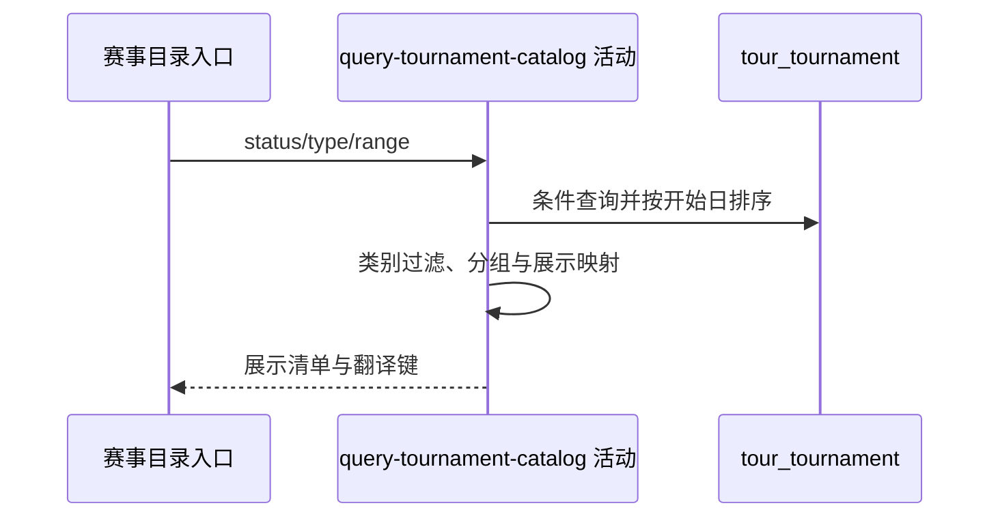

## 概要

筛选职业赛事，完成类别过滤、展示分组和 DTO 组装。

## 时序图

## 触发条件

匿名或登录访问者请求职业赛事目录时执行。

## 活动契约

输入可选 `status`、`type`、`range`；输出全部命中赛事的展示清单及待查询翻译键，不分页。未知筛选值不限制对应维度。

## 异常分支

| 错误标识 | 触发条件 | 处理 |
|---|---|---|
| 无 | 无命中或全部被类别门槛排除 | 返回空列表 |
| `OPERATION_FAILED` | 读取、分组、日期格式化或背景图签名失败 | 终止整体，不返回部分结果 |

## 领域依赖

无

## 业务动作

A1 解释筛选条件并查询赛事
A2 过滤低类别赛事
A3 按城市和赛期分组
A4 映射展示字段与背景图

## 详细流程

1. `status` 仅精确识别大写 FINISHED→completed、ONGOING/UPCOMING→active；`type` 原样匹配。`range` 不区分大小写，recent 取今日前后各一月的赛期交集，live 强制 active 且覆盖今日。
2. 数据按 start_date 升序且不分页；排除可解析为整数且小于 250 的 category，空白、非数字或至少 250 均保留。
3. 新赛事只与每组首项比较：城市忽略大小写且赛期相交才归组；空城市按空串，任一日期端点为空则不匹配已有组。组内空开始日晚排。
4. 依当前结果顺序生成临时 `g<n>`；展示 id 仅取外部 tournament_id，不返回 year。按今日与赛期推导 FINISHED/UPCOMING/ONGOING，端点缺失时可能回退 ONGOING。
5. surface 转大写作代码并保留原值作名称；背景键非空时生成 3600 秒签名地址，不校验对象存在。
6. 收集赛事名、城市和场地表面翻译键交给后续活动；无结果时不触发翻译登记。

## 边界情况

- 未知 status/range 不筛相应维度，未知 type 通常得到空列表。
- 分组实际不比较赛事名称，同城且赛期相交即可同组。
- 同一外部赛事跨年份时响应 id 无法区分年份。

## 实现提示

只读列按 DB snapshot 声明；背景图签名属于展示映射，查询不修改赛事资料。
