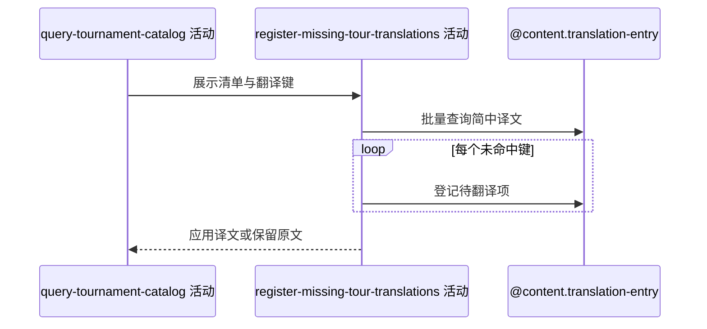

## 概要

查询简中赛事、城市和场地表面译文，并为未命中项登记空译文记录。

## 时序图

## 触发条件

赛事目录非空并已收集赛事名、城市和表面翻译键时执行。

## 活动契约

批量取得 ZH_CN 译文并替换非空命中值；未命中保留原文并逐条登记，单条保存失败不影响清单返回。

## 异常分支

| 错误标识 | 触发条件 | 处理 |
|---|---|---|
| 单项容错 | 待译记录重复或保存失败 | 记日志、保留原文并继续 |
| `OPERATION_FAILED` | 翻译查询或未捕获回写异常 | 终止整体；已登记记录不回滚 |

## 领域依赖

### @content.translation-entry

- 输入：赛事名、城市或表面实体类型，原文与 ZH_CN
- 输出：命中译文或待翻译登记结果

## 业务动作

A1 批量查询简中译文
A2 应用非空译文
A3 逐项登记缺口

## 详细流程

1. 按赛事名、城市、表面三类键批量查询 ZH_CN 缓存，非空命中值替换展示文案。
2. 未命中或空译文保留原文；按实体类型、原文和语言逐条尝试创建 translated_text 为空的记录。
3. 单条登记异常只记录日志并继续，整体无事务，已成功记录不因后续失败回滚。
4. 完成后返回全部已分组赛事；空目录不会查询或登记翻译。

## 边界情况

- 并发唯一键竞争不影响原文展示。
- 同一文案在不同实体类型下分别登记。
- 部分登记成功允许，下一次查询可继续补缺。

## 实现提示

读写翻译能力统一通过 `@content.translation-entry` 表达，作为写活动 `reads` 为空；本阶段不设计领域。
