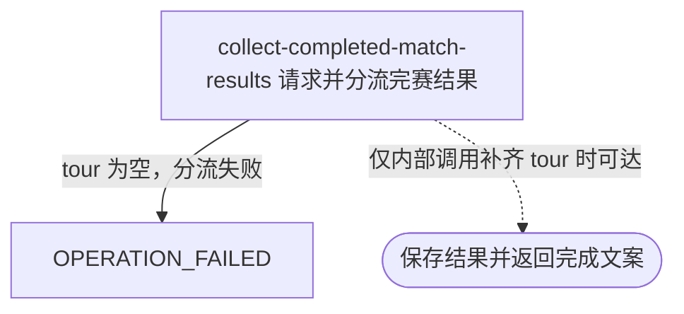

## 概要

尝试按赛事编号和年份采集单打完赛结果；当前入口必然失败。

## 触发

运营或任意匿名调用方尝试按外部赛事编号与年份补采单打完赛结果时发起。当前入口无法提供下游必需的巡回赛类型，因此没有成功执行路径。

## 接口契约

查询参数 `tournamentId`、`year` 必须出现，`year` 必须可转换为整数；不校验编号格式或年份范围。设计成功响应为纯文本 `已完成比赛采集完成`，但当前合法请求也会在巡回赛分流处失败，只会得到全局失败响应。

## 业务活动

- collect-completed-match-results  按赛事巡回赛过滤并新增或刷新单打完赛结果；当前 HTTP 入口因缺少巡回赛而在保存前失败

## 流程图

## 详细流程

1. 接收必填 `tournamentId` 与整数 `year`，入口不要求登录；不校验编号格式或年份范围。
2. 控制器仅用两个参数新建临时赛事对象，没有从名录读取并补充所属巡回赛 `tour`，随后以 `tour=null` 请求 ATP Tour App 已完成比赛接口。
3. 上游请求返回后，通用采集模板必须按 `tour` 在 ATP/MS 与 WTA/LS 间分流；对 `null` 调用枚举解析必然抛出异常。因此当前每次调用都在转换前终止，返回调用失败，不会新增签表或保存比赛，也不会返回“已完成比赛采集完成”。
4. 若未来入口补齐有效 `tour`，下游会先核对响应赛事编号和年份，再按 ATP=`MS`、WTA=`LS` 过滤单打；空来源、错赛或无目标比赛将正常跳过并返回完成文案。
5. 可达的下游转换会映射轮次、双方、胜方、场地、状态和有效盘分，以 `(tournamentId, year, drawType)` 关联或新建空结构签表，再按 `(drawId, matchId)` 以非空字段新增或刷新比赛。
6. 签表和比赛分别提交，比赛失败可能留下新签表；来源遗漏或空值不删除、清空存量，状态没有方向约束。该逻辑当前只能被其他已提供 `tour` 的内部调用复用，不能由本 HTTP 入口成功触达。

## 异常分支

| 对外失败码 | 触发条件 | 由哪个活动报出 | 补偿动作或超时处理 | 对外提示 |
|---|---|---|---|---|
| `OPERATION_FAILED` | `tournamentId` / `year` 缺失，或年份类型错误 | 流程入口参数绑定 | 未请求来源、不写数据 | 参数错误或系统异常 |
| `OPERATION_FAILED` | 所有参数合法，但入口构造的采集参数 `tour=null` | collect-completed-match-results | 上游请求可能已经发出；异常发生在结果分流时，任何本地保存尚未开始 | 系统异常，请稍后重试 |
| 无（当前入口不可达） | 有效 `tour` 的内部调用遇到空响应、空比赛、无 `MS`/`LS` 或响应赛事不匹配 | collect-completed-match-results | 不新增签表或比赛 | 已完成比赛采集完成 |
| `OPERATION_FAILED`（当前入口不可达） | 有效 `tour` 的内部调用在比赛身份校验或保存时失败 | collect-completed-match-results | 比赛批次回滚；此前独立提交的新签表可能保留 | 系统异常，请稍后重试 |

下游可达时，未知状态与无有效盘分形成 `null`，不会清空存量；新比赛可能因必填约束失败。同批同键比赛按后到的非空字段合并，身份冲突拒绝整批。以上保存分支不会由当前 HTTP 入口触发。

## 技术线索

- HTTP：`GET /tour/collect/completed?tournamentId=...&year=...`，普通鉴权排除范围
- 入口：`TourCollectController.completed()` 只设置 `TournamentData.tournamentId/year`
- 调用：`TourCollectFacade.completed()` → `MatchCollectManager.collect(ATP_APP_COMPLETED)`
- 必现失败：`AbstractMatchCollectClient.fetch()` → `TourEnums.valueOf(params.getTour())`，其中 `tour=null`
- 来源转换：`AtpCompletedMatchCollectClient`；ATP=`MS`、WTA=`LS`
- 潜在保存：`DrawCollectService.saveOrUpdate()`、`MatchCollectService.saveMatches()`
