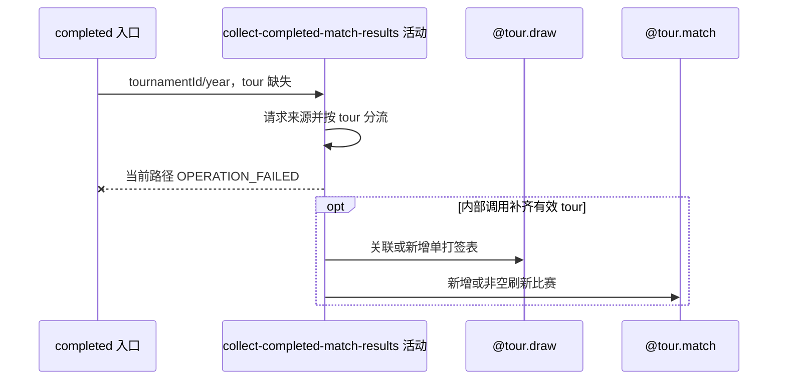

## 概要

过滤并保存单打完赛结果；当前 HTTP 入口在保存前必然失败。

## 时序图

## 触发条件

匿名 HTTP 请求按赛事编号和年份补采完赛结果，或内部调用提供完整赛事参数时执行。

## 活动契约

输入 tournamentId、year 及下游必需 tour；ATP 取 MS、WTA 取 LS，校验来源赛事后关联签表并 upsert 完赛比赛。当前 HTTP 入口未提供 tour，因而无成功路径。

## 异常分支

| 错误标识 | 触发条件 | 处理 |
|---|---|---|
| `OPERATION_FAILED` | 当前入口 tour=null，枚举分流失败 | 可能已请求来源，但任何本地写入尚未开始 |
| 跳过 | 完整内部调用遇到空来源、错赛或无目标单打 | 不写入并正常完成 |
| `OPERATION_FAILED` | 可达保存路径身份校验或比赛批次失败 | 回滚比赛批次；已独立提交签表可能保留 |

## 领域依赖

### @tour.draw

- 输入：赛事编号、年份和 MS/LS 类型
- 输出：关联或新增 drawId

### @tour.match

- 输入：drawId、matchId 及完赛非空快照
- 输出：新增或刷新比赛批次

## 业务动作

A1 请求并按巡回赛分流来源
A2 校验赛事与过滤单打
A3 关联或新增签表
A4 转换并保存完赛比赛

## 详细流程

1. 当前控制器只构造 tournamentId/year，tour 为 null；来源请求后模板执行 `TourEnums.valueOf(null)`，在转换和保存前必然失败。
2. 仅当内部调用补齐有效 tour 时继续：ATP 选择 MS，WTA 选择 LS；空响应、赛事编号/year 不符或无目标比赛直接跳过。
3. 按 `(tournamentId,year,drawType)` 关联或新增空结构签表，签表事务先独立提交。
4. 映射轮次、双方、胜方、场地、状态与有效盘分；按 `(drawId,matchId)` 新增或以来源非空字段刷新，状态没有前进约束。
5. 来源空值不清存量，遗漏比赛不删除；同批同键以后到非空字段合并，身份冲突使整批失败。
6. 比赛事务失败不回滚前置签表；当前 HTTP 入口永远不会返回设计的成功文案。

## 边界情况

- tournamentId/year 参数合法也无法弥补 tour 缺失。
- 未知状态或无有效盘分映射为 null，新比赛可能触发存储必填约束。
- 本活动记录现状缺陷，不把潜在内部成功路径误写成 HTTP 可达。

## 实现提示

写入通过 `@tour.draw` 与 `@tour.match` 表达，`reads` 为空；ATP Tour App RPC snapshot 当前缺失。
