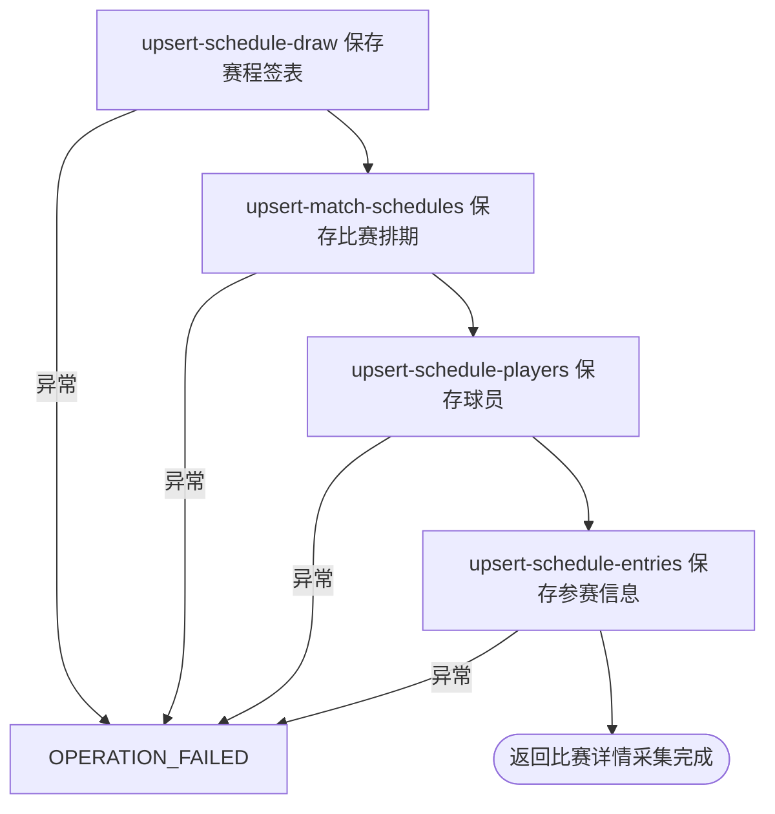

## 概要

手动刷新当前职业赛事的单打比赛时间与场地安排。

## 触发

运营或任意匿名调用方需要立即刷新运行日附近职业赛事的单打排期时发起。入口无参数，目标由本地赛事赛期决定。

## 接口契约

无请求参数。正常结束返回纯文本 `比赛详情采集完成`；没有当前赛事、未知巡回赛被跳过或来源为空时不另行提示，也不返回成功、失败、跳过或分赛事统计。

## 业务活动

- upsert-schedule-draw  为赛程关联或新增单打签表
- upsert-match-schedules  按签表与比赛编号新增或刷新比赛排期快照
- upsert-schedule-players  按巡回赛与球员编号补充赛程来源球员
- upsert-schedule-entries  按签表与球员补充种子和入围信息

## 流程图

## 详细流程

1. 接收无参数 HTTP 请求，入口不要求登录。按运行时当地日期读取赛期与 `[昨日, 明日]` 相交的全部本地赛事，不按状态筛选；无赛事时仍返回完成文案。
2. 逐项路由来源：普通 ATP 用 Tennis TV OOP，ATP 大满贯用 ATP Tour Schedule，普通 WTA 用 WTA Schedule，WTA 大满贯用 ATP Tour 的 WTA Schedule。未知巡回赛忽略，空 `category` 可能使调用失败。
3. 只处理来源产出的目标单打；默认排除双打。解析比赛日期、计划时间、来源排期文本、场地、场序、轮次、对阵、状态，以及来源附带的胜方、结束时间和比分。
4. 带时区的时间转为中国标准时间；“随后”场次按同场顺序推算，Tennis TV 普通 ATP 每场加 100 分钟，ATP Tour/WTA 来源每场加 70 分钟。无法解析的日期、时间、轮次或种子留空。
5. 以 `(tournamentId, year, drawType)` 新增或刷新签表，再按 `(drawId, matchId)` 新增或以非空字段刷新比赛；来源遗漏不删除，状态可以回退。
6. 来源含球员与种子时，按 `(tour, playerId)` 保存球员，并按 `(drawId, playerId)` 保存参赛资料。签表、比赛、球员、参赛步骤分别提交，中途失败保留此前变更。
7. `oop()` 没有逐赛事异常隔离，任一赛事转换或保存异常终止后续赛事；成功、空来源或跳过场次最终都返回纯文本“比赛详情采集完成”，不交付统计。

## 异常分支

| 对外失败码 | 触发条件 | 由哪个活动报出 | 补偿动作或超时处理 | 对外提示 |
|---|---|---|---|---|
| 无 | 没有当前赛事、未知巡回赛、来源为空或没有目标单打 | 目标/来源读取 | 对应目标不更新，继续后续赛事 | 比赛详情采集完成 |
| `OPERATION_FAILED` | ATP/WTA 赛事 `category=null`，或来源转换/排期推算发生未处理异常 | 来源路由与转换 | 终止后续赛事；此前已提交数据保留 | 系统异常，请稍后重试 |
| `OPERATION_FAILED` | 比赛关键身份缺失、身份冲突或任一保存步骤失败 | 四个保存活动 | 失败步骤自身事务回滚；此前赛事和此前步骤保留，不补偿 | 系统异常，请稍后重试 |

日期、时间、轮次、种子或状态无法解析时相应字段为 `null`，不清空存量；新记录能否保存取决于数据库必填约束。同批同键比赛以后到非空字段合并，来源遗漏对象不删除。

## 技术线索

- HTTP：`GET /tour/collect/oop`，普通鉴权排除范围
- 入口：`TourCollectController.oop()` → `TourCollectFacade.oop()`
- 路由：`ATP_OOP`、`ATP_SCHEDULE`、`WTA_SCHEDULE`、`ATP_SCHEDULE_FOR_WTA`
- 时区：`Asia/Shanghai`；随后推算 100 分钟（ATP_OOP）或 70 分钟（Schedule 来源）
- 编排：`MatchCollectManager.collect()`
- 保存：`DrawCollectService`、`MatchCollectService`、`PlayerCollectService`、`TournamentCollectService.saveEntries()`
- 双打开关：`tour.collect.doubles`，默认 `false`
