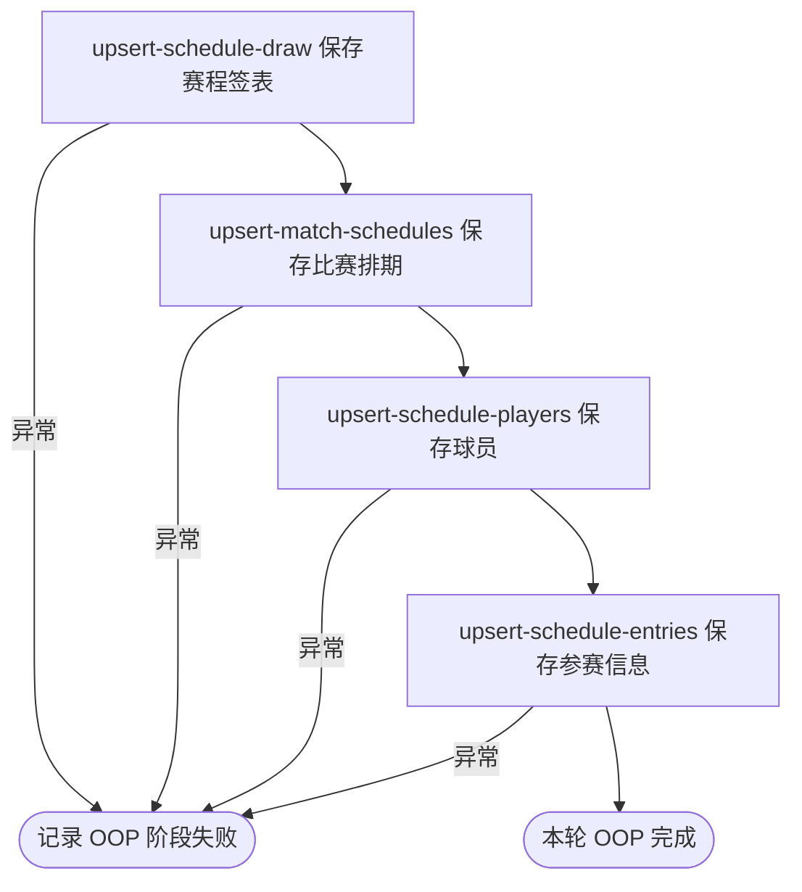

## 概要

每小时刷新当前职业赛事的单打比赛时间与场地安排。

## 触发

统一职业比赛采集任务启用后，每五分钟唤醒；OOP 阶段只在绝对整点执行，约每 60 分钟一次。该阶段位于 LIVE 之后、DRAW 之前，调度未指定时区。

## 接口契约

无请求参数和对外响应。每轮目标为赛期与运行日 `[昨日, 明日]` 相交的全部本地赛事，不按状态过滤；不交付数量、失败对象或完整性结果。

## 业务活动

- upsert-schedule-draw  为赛程关联或新增单打签表
- upsert-match-schedules  按签表与比赛编号新增或刷新比赛排期快照
- upsert-schedule-players  按巡回赛与球员编号补充赛程来源球员
- upsert-schedule-entries  按签表与球员补充种子和入围信息

## 流程图

## 详细流程

1. 仅在 `job.tour.enabled=true` 时装配统一比赛采集任务，底层按 `0 */5 * * * ?` 触发；OOP 阶段只在绝对分钟数可被 60 整除时执行。调度未指定时区。
2. 按运行时当地日期读取赛期与 `[昨日, 明日]` 相交的赛事，不按状态筛选。普通 ATP、ATP 大满贯、普通 WTA、WTA 大满贯分别路由 Tennis TV OOP、ATP Tour Schedule、WTA Schedule、ATP Tour WTA Schedule。
3. 保留目标单打并解析/推算中国标准时间排期、场地场序、轮次、对阵与来源附带的状态、胜方和比分；默认排除双打，解析失败字段留空。
4. 依次按身份保存签表、比赛、球员与参赛资料；存量只被非空字段覆盖，来源遗漏不删除，状态不校验方向，各步骤独立提交。
5. 任一赛事未处理异常会终止后续赛事并冒泡，由统一任务捕获记录 OOP 阶段失败；已提交数据不回滚，同轮后续 DRAW 阶段仍可执行。
6. 任务不产生业务响应、统计、即时重试或补偿；空范围或空来源静默结束，失败对象只在日志中体现，后续尝试依赖下一小时门槛。

## 异常分支

| 对外失败码 | 触发条件 | 由哪个活动报出 | 补偿动作或超时处理 | 对外提示 |
|---|---|---|---|---|
| 无 | OOP 频率门槛未命中、没有当前赛事、未知巡回赛或来源为空 | 调度 / 目标与来源读取 | 本轮不执行或跳过目标，等待后续调度 | 无 |
| 无 | 空类别、来源转换或任一保存步骤发生未处理异常 | 四个保存活动或来源路由 | 终止后续赛事；统一任务记录 OOP 失败，此前提交保留，同轮继续 DRAW | 无 |
| 无 | 比赛身份缺失或冲突 | upsert-match-schedules | 比赛批次回滚，已保存签表保留；不即时重试 | 无 |

解析失败字段为 `null` 且不清空存量；来源遗漏不删除。任务没有跨步骤/赛事事务、业务重试、补偿或失败清单，后续尝试依赖下一次整点门槛。

## 技术线索

- 任务：`TourCollectJob.matches()`；装配条件 `job.tour.enabled=true`
- 底层 cron：`job.tour.collect.live.cron`，生产值 `0 */5 * * * ?`，无 `zone`
- OOP 门槛：`CollectType.Phase.OOP(60).shouldRun(epochMinute)`
- 调用：`TourCollectFacade.matches(OOP)` → `oop()` → `MatchCollectManager.collect()`
- 路由：`ATP_OOP`、`ATP_SCHEDULE`、`WTA_SCHEDULE`、`ATP_SCHEDULE_FOR_WTA`
- 时区：`Asia/Shanghai`；随后推算 100 或 70 分钟
