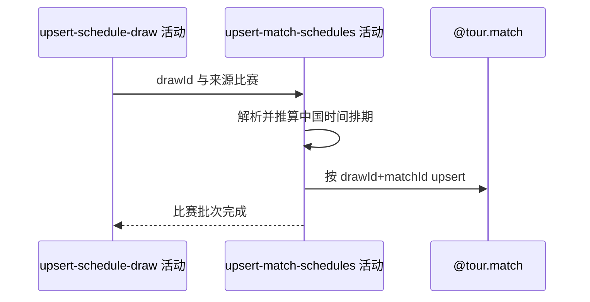

## 概要

按签表与比赛编号新增或非空刷新比赛排期快照。

## 时序图

## 触发条件

单打签表已取得 drawId 后执行。

## 活动契约

输入来源比赛集合；映射排期、场地场序、轮次、对阵、状态、胜方和比分，按 `(drawId,matchId)` 新增或仅以非空字段覆盖存量。

## 异常分支

| 错误标识 | 触发条件 | 处理 |
|---|---|---|
| 字段降级 | 日期、时间、轮次或状态无法解析 | 字段置 null，不清存量 |
| `OPERATION_FAILED`/调度日志 | 关键身份缺失、冲突、转换或批量保存失败 | 回滚比赛批次；签表保留，终止后续赛事 |

## 领域依赖

### @tour.match

- 输入：drawId、matchId 与赛程非空快照
- 输出：新增或刷新比赛批次

## 业务动作

A1 解析并推算比赛排期
A2 映射比赛完整快照
A3 按身份非空 upsert

## 详细流程

1. 解析比赛日期、计划时间、排期原文、场地、场序、轮次、双方及来源附带的胜方、结束时间、状态和盘分。
2. 带时区时间转为 Asia/Shanghai；“随后”场次按同场顺序推算，Tennis TV ATP 每场加 100 分钟，ATP Tour/WTA 来源每场加 70 分钟。
3. 按 `(drawId,matchId)` upsert；同批同键以后到的非空字段合并，关键身份冲突拒绝整批。
4. 仅非空来源字段覆盖，状态允许回退；解析为空及来源遗漏不会清空或删除存量。
5. 比赛在独立事务提交；失败时前置签表和此前赛事保留。

## 边界情况

- 新记录的必填字段为空时可能由数据库约束拒绝。
- 无法解析的种子不属于本活动，由参赛活动降级为空。
- 定时失败无即时重试，等待下一次整点 OOP 门槛。

## 实现提示

写入使用 `@tour.match`，`reads` 为空；时间推算规则属于来源适配现状。
