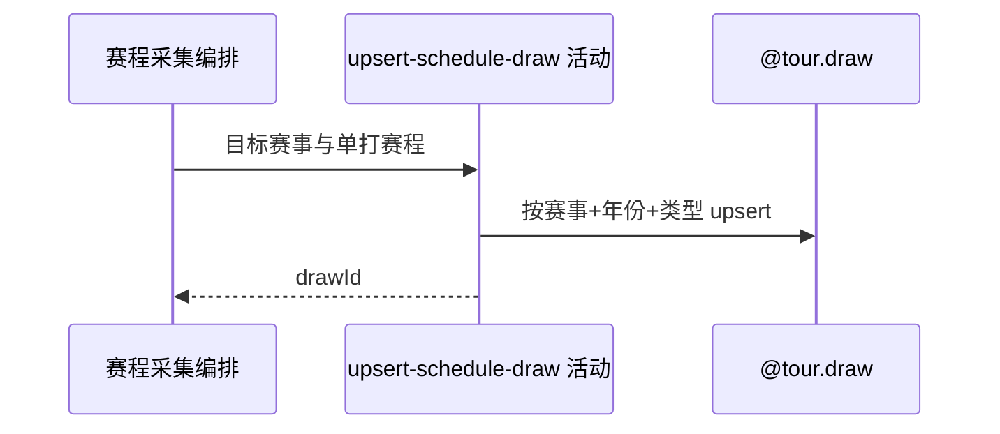

## 概要

为有效单打赛程关联或新增赛事签表。

## 时序图

## 触发条件

当前赛事来源非空且产出目标单打比赛时执行。

## 活动契约

输入赛事编号、年份、单打类型及来源签表结构；按 `(tournamentId,year,drawType)` 关联或新增，并以非空结构字段刷新，输出 drawId。

## 异常分支

| 错误标识 | 触发条件 | 处理 |
|---|---|---|
| 跳过 | 未知 tour、空来源或无目标单打 | 不写入，继续可处理赛事 |
| `OPERATION_FAILED`/调度日志 | 空 category、转换或保存失败 | 回滚本步骤并终止后续赛事；此前提交保留 |

## 领域依赖

### @tour.draw

- 输入：赛事编号、年份、单打类型与非空结构字段
- 输出：关联或新增 drawId

## 业务动作

A1 路由并筛选赛程来源
A2 确定单打签表身份
A3 关联或新增签表

## 详细流程

1. 目标为赛期与 `[昨日,明日]` 相交的赛事，不筛状态；普通 ATP、ATP 大满贯、普通 WTA、WTA 大满贯分别路由四类来源，未知 tour 跳过。
2. 默认排除双打，仅在来源产出目标单打时进入保存；空 category 可能在来源选择时失败。
3. 按 `(tournamentId,year,drawType)` upsert，来源非空 size/totalRounds 可刷新，遗漏字段保留存量。
4. 签表使用独立事务，提交后才保存比赛；后续失败不会补偿签表。

## 边界情况

- 没有当前赛事时手动仍返回完成，定时静默。
- 单项异常终止后续赛事；定时外层记录 OOP 失败并继续 DRAW 阶段。
- 手动入口匿名可调用且不返回分赛事统计。

## 实现提示

写入使用 `@tour.draw`，`reads` 为空；四类赛程 RPC snapshot 当前未覆盖完整。
