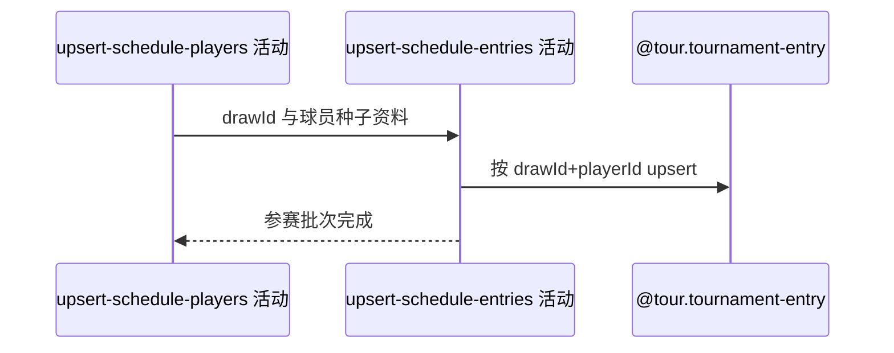

## 概要

按签表与球员补充赛程中的种子和入围资料。

## 时序图

## 触发条件

赛程球员保存成功且来源带有签表参赛信息时执行。

## 活动契约

输入 drawId、playerId、可选种子和入围信息；按 `(drawId,playerId)` 新增或非空刷新，来源遗漏不删除。

## 异常分支

| 错误标识 | 触发条件 | 处理 |
|---|---|---|
| 字段降级 | 种子无法解析 | seed 为空，其他信息继续 |
| `OPERATION_FAILED`/调度日志 | 参赛身份缺失、冲突或批量保存失败 | 回滚参赛批次；前三步保留，终止后续赛事 |

## 领域依赖

### @tour.tournament-entry

- 输入：drawId、playerId 与非空种子/入围字段
- 输出：新增或刷新参赛资料

## 业务动作

A1 提取球员参赛属性
A2 按签表身份去重
A3 新增或非空刷新参赛资料

## 详细流程

1. 从赛程来源提取双方 playerId、seed 及 qualifier 等入围信息；不可解析种子降级为空。
2. 按 `(drawId,playerId)` 识别参赛资料，同批重复身份合并。
3. 新记录保存可用字段；存量仅被非空来源字段覆盖，空值和来源遗漏不清空、不删除。
4. 参赛资料使用最后一个独立事务；失败不回滚签表、比赛或球员。

## 边界情况

- 无参赛附加信息时可不写本步骤。
- 同一球员进入不同签表时分别建参赛身份。
- 手动成功文案不表示每个来源都产生写入。

## 实现提示

写入使用 `@tour.tournament-entry`，`reads` 为空；不声明写表。
