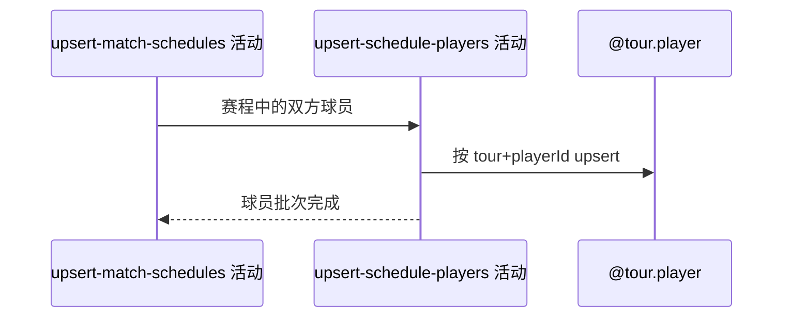

## 概要

按巡回赛与球员编号补充赛程来源球员资料。

## 时序图

## 触发条件

比赛排期保存成功且来源带有可识别球员时执行。

## 活动契约

输入来源双方球员，以 `(tour,playerId)` 为身份新增或用非空资料刷新；无球员不写入。

## 异常分支

| 错误标识 | 触发条件 | 处理 |
|---|---|---|
| 跳过 | 来源不含可识别球员 | 不写球员，继续参赛步骤 |
| `OPERATION_FAILED`/调度日志 | 身份冲突、转换或批量保存失败 | 回滚球员批次；签表比赛保留，终止后续赛事 |

## 领域依赖

### @tour.player

- 输入：tour、playerId 与来源非空资料
- 输出：新增或刷新职业球员

## 业务动作

A1 汇总双方球员
A2 按巡回赛身份去重
A3 非空刷新球员资料

## 详细流程

1. 从目标单打赛程汇总双方球员，以巡回赛和外部 playerId 作为本地身份。
2. 同批重复身份合并；姓名、国籍等来源非空字段可刷新，空值不清存量。
3. 批量在独立事务提交，来源遗漏球员不删除、不失效。
4. 保存失败只回滚球员批次，已提交签表和比赛保留，参赛活动不执行。

## 边界情况

- 同一 playerId 在 ATP/WTA 下属于不同身份。
- 单方资料缺失不阻止另一方保存。
- 球员资料不完整时由存储约束决定新记录能否落库。

## 实现提示

写入使用 `@tour.player`，`reads` 为空；本阶段不设计领域。
