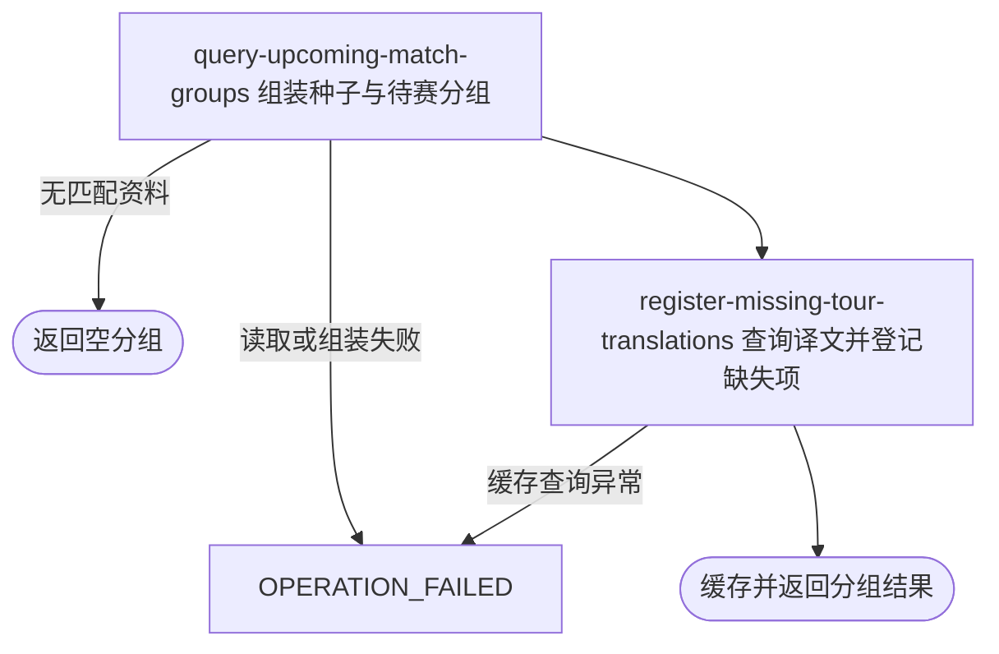

## 概要

按赛事编号交付种子状态与日期、球场两级待赛分组。

## 触发

用户或匿名访问者要查看一个或多个职业赛事的种子状态及后续赛程分组时发起。一次返回全部命中数据，不分页。

## 接口契约

查询参数 `tournamentIds` 必须出现并绑定为字符串列表；只提供赛事编号，不提供年份。成功返回对象包含 `seed` 种子分组和 `match` 日期/球场两级比赛分组；没有匹配数据时两者均为空数组。

响应按原列表对象作为键在当前应用实例缓存 1 分钟，列表元素顺序和内容影响缓存键。缓存命中直接返回此前已翻译 DTO，期间数据库与译文变化不可见。

## 业务活动

- query-upcoming-match-groups  汇总种子状态并组装日期、球场两级待赛比赛分组
- register-missing-tour-translations  为简中缓存未命中的球场与球员显示名登记待翻译项

## 流程图

## 详细流程

1. 接收必填的 `tournamentIds` 查询参数，可重复或以列表方式绑定；入口不要求登录。结果按列表对象作为本机缓存键缓存 1 分钟，缓存命中直接返回已有 DTO，不重新查询或登记翻译。
2. 参数列表为空时交付空种子分组与空比赛分组。否则汇总所选赛事编号下全部年份、签表和参赛状态的非零种子，不按年份或签表类型隔离。
3. 查询所选赛事全部精确大写 `FINISHED` 比赛；球员在任一完赛比赛中出现且不是胜方即标为淘汰，最后遍历到的败局轮次作为标签。未淘汰且赛事 tour 为 ATP 归 ATP 组，其他全部归 WTA 组；淘汰者归淘汰组，各组按种子号升序。
4. 查询有 `matchDate` 且状态不等于精确大写 `FINISHED` 的比赛，收集其日期，再补入同赛事、同这些日期的已结束比赛。双方编号都为空的场次丢弃。
5. 按球员编号补资料，比赛球员姓名优先姓、再名；缺资料时以编号作姓名。按赛事编号与球员取种子，组装国家/地区、轮次、原状态、排期、盘分、胜方和时长。
6. 先按日期分组；展示锚点为今天与结果最早日期中的较早者，锚点显示“今天”、次日显示“明天”。日期内按原始球场分组，同场有胜方者优先，其余按计划时间升序。
7. 球场名含 `Court <数字>` 的组按数字升序且排在无数字球场之后；无数字球场按场内最小种子号升序，无种子最后。日期组按日期字符串升序。
8. 查询球场组名、比赛双方姓名与种子姓名的简中译文；命中替换，未命中保留原文并逐条尝试登记待译项。最终返回 `seed` 与 `match`，查询结果连同译文在本机缓存 1 分钟。

## 异常分支

| 对外失败码 | 触发条件 | 由哪个活动报出 | 补偿动作或超时处理 | 对外提示 |
|---|---|---|---|---|
| `OPERATION_FAILED` | 必填 `tournamentIds` 参数未出现 | 流程入口参数绑定 | 未查询、不登记待译项 | 系统异常，请稍后重试 |
| 无 | 列表为空或赛事编号没有比赛、签表、种子资料 | query-upcoming-match-groups | 缺失部分或整体返回空分组 | 查询成功 |
| 无 | 一场比赛双方编号均为空 | query-upcoming-match-groups | 丢弃该场，其他比赛继续 | 无 |
| `OPERATION_FAILED` | 种子/比赛/球员读取、DTO 组装、日期解析或排序发生未处理异常 | query-upcoming-match-groups | 终止整体，不返回部分分组；职业赛事数据不变 | 系统异常，请稍后重试 |
| `OPERATION_FAILED` | 翻译缓存查询发生未处理异常 | register-missing-tour-translations | 终止整体；此前成功登记的待译项不回滚 | 系统异常，请稍后重试 |

球员缺资料、国家码未知、状态未知、排期字段不足或比分不完整均按详细流程降级返回。单条待译保存失败只记录日志；成功结果缓存后，1 分钟内不重复登记待译项。

## 技术线索

- HTTP：`GET /tour/match/upcoming?tournamentIds=...`，普通鉴权排除范围
- 入口：`TourMatchController.upcoming()` → `TourMatchAppService.upcoming()`
- 缓存：`@Cacheable(value="upcoming", key="#p0")`；Caffeine `expireAfterWrite(1 minute)`
- 领域查询：`TourMatchQueryDomainService.seedGroups()` / `upcomingDateGroups()`
- 比赛范围：`listUnfinishedByTournamentIds()` + `listFinishedByTournamentIdsAndDates()`
- 排序：`UPCOMING_COURT_MATCH_COMPARATOR`、`extractCourtNumber()`、`getMinSeed()`
- 翻译：`TourTranslationService.matchGroups()` / `matches()` / `seeds()`，语言 `ZH_CN`
- 响应：`Result<TourMatchDTO>`
