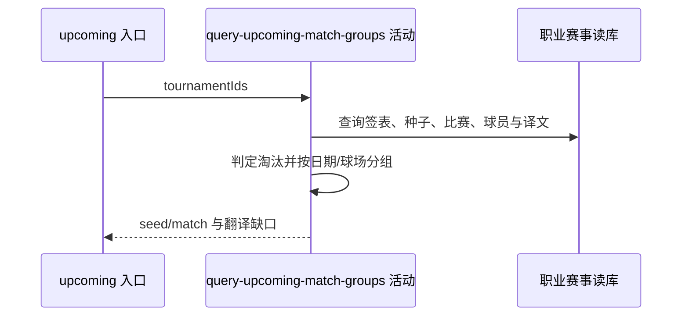

## 概要

汇总种子状态并组装日期、球场两级待赛分组。

## 时序图

## 触发条件

必填 tournamentIds 成功绑定且一分钟本机缓存未命中时执行。

## 活动契约

输入赛事编号列表，不区分年份；输出 ATP/WTA/淘汰种子组及日期、球场两级比赛组和待译键。空列表或无资料返回空分组。

## 异常分支

| 错误标识 | 触发条件 | 处理 |
|---|---|---|
| 跳过 | 双方 playerId 均为空 | 丢弃该场，其他继续 |
| `OPERATION_FAILED` | 数据读取、日期解析、盘分组装或排序失败 | 终止整体，不返回部分分组 |

## 领域依赖

无

## 业务动作

A1 汇总跨年份种子状态
A2 查询待赛日期范围比赛
A3 补球员、种子和比分
A4 按日期与球场排序分组
A5 应用译文并收集缺口

## 详细流程

1. 汇总所选赛事编号下全部年份、签表的非零种子；读取精确大写 FINISHED 比赛，球员在任一败局中出现即淘汰，最后遍历到的败局轮次作标签。
2. 未淘汰且赛事 tour=ATP 归 ATP 组，其余归 WTA，淘汰者归淘汰组；各组按种子升序。
3. 查询 match_date 非空且 status 不等于精确 FINISHED 的比赛，再补同赛事、同日期的完赛场次；双方编号都空的比赛过滤。
4. 姓名优先 lastName、再 firstName，缺球员资料回退 playerId；补国家、种子、胜方、原状态、排期、盘分和时长。
5. 先按日期分组；展示锚点为今日与最早结果日期中较早者，锚点/次日标“今天/明天”。日期内按原球场分组，同场有胜方优先，再按计划时间。
6. 含 `Court <数字>` 的球场按数字升序但排在无数字球场之后；无数字球场按场内最小种子升序，无种子最后。日期字符串升序。
7. 应用球场与球员 ZH_CN 非空译文，未命中保留原文并输出缺口；最终 DTO 由上层按原列表键缓存一分钟。

## 边界情况

- tournamentIds 只含编号，跨年份、签表和类型会合并。
- 淘汰轮次取最后遍历到的败局，不保证是时间最晚一场。
- 缓存键受列表顺序和内容影响，命中期间数据库与译文变化不可见。

## 实现提示

只读列按 DB snapshot 声明；缓存位于活动外层，命中时活动整体不执行。
