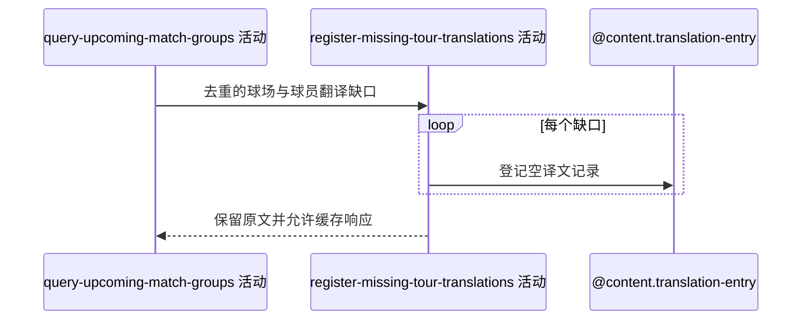

## 概要

为未命中的简中球场与球员显示名登记待翻译项。

## 时序图

## 触发条件

种子或比赛展示字段存在 ZH_CN 翻译缺口时执行。

## 活动契约

逐条登记球场与球员显示名的待译记录；单条失败只记录日志，保留原文，成功结果随后进入一分钟缓存。

## 异常分支

| 错误标识 | 触发条件 | 处理 |
|---|---|---|
| 单项容错 | 重复或单条保存失败 | 记录日志并继续，保留原文 |
| `OPERATION_FAILED` | 未捕获翻译回写异常 | 终止整体；已登记记录不回滚 |

## 领域依赖

### @content.translation-entry

- 输入：球场/球员实体类型、原文与 ZH_CN
- 输出：待翻译记录或失败结论

## 业务动作

A1 去重翻译缺口
A2 逐项登记待译记录
A3 保留原文并完成响应

## 详细流程

1. 仅对查询活动未命中的球场组名、比赛双方姓名和种子姓名生成缺口。
2. 按实体类型、原文、语言去重，尝试创建 translated_text 为空的 ZH_CN 记录。
3. 单条异常只记日志并继续；整体无事务，部分成功允许，原文始终可展示。
4. 登记后 DTO 进入一分钟本机缓存；缓存命中期间不会重复登记。

## 边界情况

- 同一球员名在种子组和比赛组共用翻译键时只需登记一次。
- 并发唯一键冲突不影响业务响应。
- 无展示资料或译文均命中时不写入。

## 实现提示

写入使用 `@content.translation-entry`，`reads` 为空；本阶段不设计领域。
