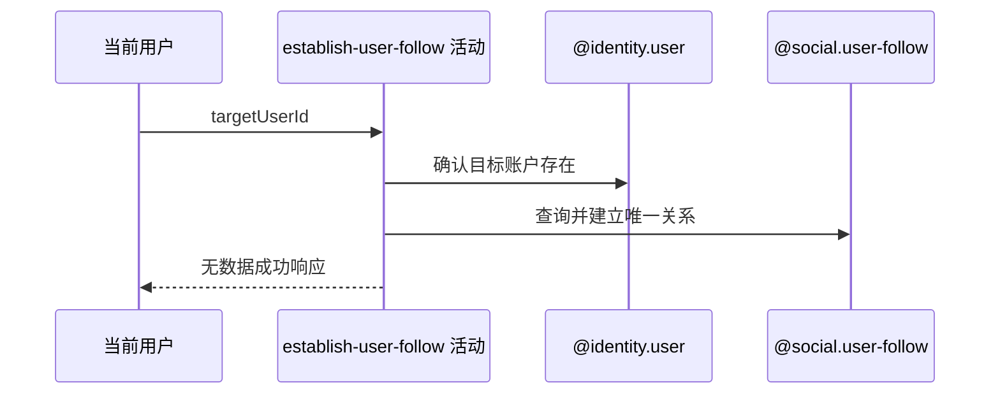

## 概要

校验目标并幂等建立唯一单向关注关系。

## 时序图

## 触发条件

登录用户提交非空白 targetUserId 时执行。

## 活动契约

拒绝关注本人并要求目标账户存在；按 `(followerId,followingId)` 幂等建立关系，成功不返回关系编号。

## 异常分支

| 错误标识 | 触发条件 | 处理 |
|---|---|---|
| `FOLLOW_SELF_NOT_ALLOWED` | 目标编号与当前用户完全相同 | 不建立关系 |
| `TOKEN_INVALID` | 目标账户不存在 | 不建立关系 |
| 无 | 同向关系已存在 | 保留原关系并成功 |
| `OPERATION_FAILED` | 读取、保存或并发唯一键冲突 | 不补查、不重试；并发另一请求的关系可保留 |

## 领域依赖

### @identity.user

- 输入：目标 userId
- 输出：账户存在性

### @social.user-follow

- 输入：当前用户、目标用户
- 输出：已有或新建的唯一单向关系

## 业务动作

A1 拒绝本人目标
A2 确认目标账户
A3 幂等建立关注

## 详细流程

1. targetUserId 由入口校验非空白，但不裁剪、不校验格式或长度；发起人只信任登录上下文，不重查账户。
2. 与当前 userId 完全相同时拒绝；否则读取目标用户，网球档案缺失不影响，账户不存在复用 TOKEN_INVALID。
3. 按 `(followerId,followingId)` 查询；存在则直接成功且不改变 bizId/createTime。
4. 不存在则生成业务编号并插入；检查与插入无同一显式事务，并发首次关注可能使一方遇唯一冲突。
5. 成功返回 data=null，不通知目标用户。

## 边界情况

- 大小写或空格不同的目标编号不会被规范化。
- 重复关注是幂等成功，并发首次关注不保证双方都成功。
- 目标没有网球档案仍可被关注。

## 实现提示

写入通过 `@social.user-follow` 表达，目标校验使用 `@identity.user`；`reads` 为空。
