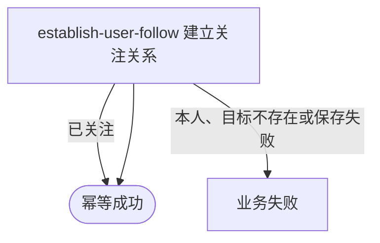

## 概要

为当前登录用户建立一条唯一的单向关注关系。

## 触发

已登录用户希望单向关注另一个用户时发起。重复关注作为幂等成功处理。

## 接口契约

请求体 JSON 只需 `targetUserId`，必须非空白。成功返回标准成功响应且 `data=null`，不交付关系编号、建立时间或目标用户资料。

## 业务活动

- establish-user-follow  校验目标并建立唯一单向关注关系

## 流程图

## 详细流程

1. 普通登录鉴权从请求凭据建立当前用户上下文；请求体必须可解析，`targetUserId` 必须非空白，但不裁剪、不校验格式或长度。
2. 拒绝目标编号与当前用户编号完全相同的请求；不重新确认发起人的账户记录。
3. 按目标编号读取用户聚合并确认其账户存在；目标没有网球档案不影响关注，但目标不存在复用登录凭证无效错误。
4. 按 `(followerId, followingId)` 检查关系；已存在时直接成功，不改变关系编号或建立时间。
5. 不存在时生成关注关系编号并插入唯一关系。检查与插入不在同一显式事务中，并发首次关注可能由数据库唯一约束拒绝其中一次。
6. 成功返回无数据响应；不返回关系编号或目标资料，不通知目标用户。

## 异常分支

| 对外失败码 | 触发条件 | 由哪个活动报出 | 补偿动作或超时处理 | 对外提示 |
|---|---|---|---|---|
| 登录相关错误 | 未携带、格式错误、过期或不可验证的登录凭据 | 登录鉴权 | 不进入活动 | 登录已过期或登录凭证无效，请重新登录 |
| `OPERATION_FAILED` | 请求体缺失或无法解析 | 入口绑定 | 不建立关系 | 系统异常，请稍后重试 |
| 参数校验错误 | `targetUserId` 缺失或空白 | 入口校验 | 不建立关系 | targetUserId: 目标用户不能为空 |
| `FOLLOW_SELF_NOT_ALLOWED` | 目标编号与当前用户完全相同 | establish-user-follow | 不建立关系 | 不能关注自己 |
| `TOKEN_INVALID` | 目标编号没有存在的用户账户 | establish-user-follow | 不建立关系 | 登录凭证无效，请重新登录 |
| 无 | 同向关系已经存在 | establish-user-follow | 保留原关系编号和建立时间 | 成功 |
| `OPERATION_FAILED` | 并发首次关注发生唯一冲突，或读取/保存异常 | establish-user-follow | 已由另一请求建立的关系保留；当前请求不补查、不重试 | 系统异常，请稍后重试 |

## 技术线索

- HTTP：`POST /user/follow`
- 登录：`AuthInterceptor` / `UserContext.get()`
- 请求：`FollowCmd.targetUserId`，`@NotBlank`
- 应用：`FollowAppService.follow()` → `UserFollowDomainService.follow()`
- 目标校验：`UserProfileDomainService.get()`
- 保存：`UserFollowRepository.exists()` / `insert()`；身份键 `follower_id + following_id`
