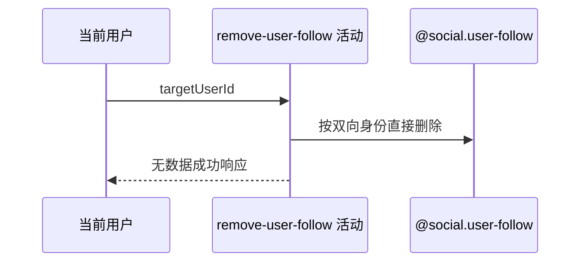

## 概要

幂等删除当前用户指向目标编号的单向关注关系。

## 时序图

## 触发条件

登录用户提交非空白 targetUserId 解除关注时执行。

## 活动契约

按 `(当前用户,targetUserId)` 直接删除；目标不存在、等于本人或关系不存在均影响零行并视为成功，不返回影响行数。

## 异常分支

| 错误标识 | 触发条件 | 处理 |
|---|---|---|
| 无 | 目标或关系不存在、目标等于本人 | 影响零行，幂等成功 |
| `OPERATION_FAILED` | 删除持久化异常 | 不承诺结果，调用方可重试 |

## 领域依赖

### @social.user-follow

- 输入：followerId 与 followingId
- 输出：删除零条或一条关系

## 业务动作

A1 构造关系身份
A2 直接删除关系
A3 按幂等成功收场

## 详细流程

1. targetUserId 由入口校验非空白，但不裁剪、不校验格式或长度。
2. 不读取目标用户、不拒绝本人目标，也不预查关注关系。
3. 按 followerId=当前用户、followingId=目标编号执行删除，零行和一行均成功。
4. 返回 data=null，不交付影响行数、不通知目标。

## 边界情况

- 可对不存在的任意非空白编号调用并成功。
- 重复解除保持幂等。
- 删除异常后状态未知，安全重试仍符合幂等语义。

## 实现提示

写入通过 `@social.user-follow` 表达，`reads` 为空；不需要 `@identity.user`。
