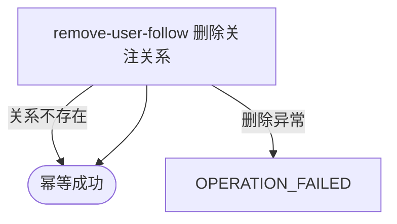

## 概要

幂等解除当前登录用户指向一个目标编号的关注关系。

## 触发

已登录用户希望停止关注一个目标编号时发起。重复解除按幂等成功处理。

## 接口契约

请求体 JSON 只需非空白 `targetUserId`。成功返回标准成功响应且 `data=null`，不返回影响行数。

## 业务活动

- remove-user-follow  删除当前用户指向目标编号的单向关注关系

## 流程图

## 详细流程

1. 通过普通登录鉴权取得当前用户；请求体 `targetUserId` 必须非空白，但不裁剪、不校验格式或长度。
2. 不校验目标用户是否存在，也不拒绝目标与本人相同。
3. 按 `(followerId=当前用户, followingId=目标编号)` 直接执行删除，不先查询关系；删除零条与删除一条都视为成功。
4. 返回标准成功响应且 `data=null`，不交付是否实际删除、关系编号、列表或计数，也不通知目标用户。

## 异常分支

| 对外失败码 | 触发条件 | 由哪个活动报出 | 补偿动作或超时处理 | 对外提示 |
|---|---|---|---|---|
| 登录相关错误 | 登录凭据缺失、格式错误、过期或不可验证 | 登录鉴权 | 不执行删除 | 登录已过期或登录凭证无效，请重新登录 |
| `OPERATION_FAILED` | 请求体缺失或无法解析 | 入口绑定 | 不执行删除 | 系统异常，请稍后重试 |
| 参数校验错误 | `targetUserId` 缺失或空白 | 入口校验 | 不执行删除 | targetUserId: 目标用户不能为空 |
| 无 | 目标不存在、等于本人或关系原本不存在 | remove-user-follow | 删除影响零条，按成功收场 | 成功 |
| `OPERATION_FAILED` | 删除持久化发生未处理异常 | remove-user-follow | 不承诺已删除；调用方可再次解除 | 系统异常，请稍后重试 |

## 技术线索

- HTTP：`POST /user/follow/cancel`
- 登录：`AuthInterceptor` / `UserContext.get()`
- 请求：`FollowCmd.targetUserId`，`@NotBlank`
- 调用：`FollowAppService.unfollow()` → `UserFollowDomainService.unfollow()`
- 删除：`UserFollowRepository.delete()`，条件 `follower_id + following_id`
