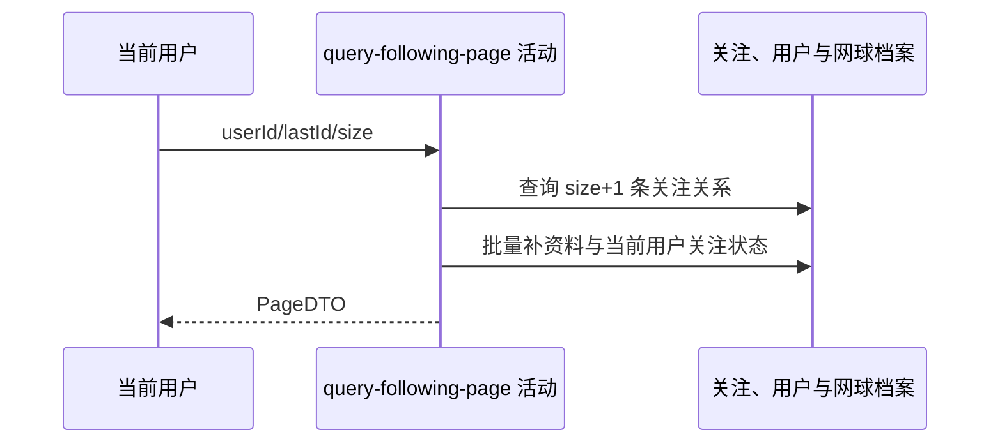

## 概要

游标分页查询关注名单并补资料与当前用户关注状态。

## 时序图

## 触发条件

登录用户查看本人或指定用户的关注名单时执行。

## 活动契约

按关系 bizId 倒序游标分页，最多返回 size 条；输出 list/hasMore，total 与 nextCursor 固定为空，每项 cursor 为关系 bizId。

## 异常分支

| 错误标识 | 触发条件 | 处理 |
|---|---|---|
| 无 | 指定用户不存在、无关注或游标后无记录 | 返回空页 |
| `OPERATION_FAILED` | 关系/资料读取或头像签名失败 | 终止整体，不返回部分页 |

## 领域依赖

无

## 业务动作

A1 选择名单所属用户
A2 游标查询关注关系
A3 补用户和网球档案
A4 标注当前用户关注状态

## 详细流程

1. userId 非空白时原样作为名单所属用户，否则用当前用户；不验证指定用户存在。size 默认 20、至少 1、无上限。
2. 按 followerId 查询；lastId 非空白时加 `bizId < lastId`，按 bizId 倒序取 size+1，多取一条判 hasMore。
3. 返回最多 size 条，total/nextCursor=null；每项 cursor=bizId，调用方取末项继续。
4. 按 followingId 批量补昵称、头像、NTRP；资料缺失仍保留 userId/cursor，展示字段为空。头像键非空生成 3600 秒签名地址。
5. isFollowed 表示当前登录用户是否关注本页用户；查看本人关注名单时通常为真，查看他人名单时反映当前用户自己的关系。

## 边界情况

- lastId 不校验格式或存在性，直接做字符串业务编号小于比较。
- 资料缺失关系不被过滤。
- size 无上限，极大值可能放大查询和签名开销。

## 实现提示

纯查询活动，读取列按 DB snapshot 精确声明；不修改关系或档案。
