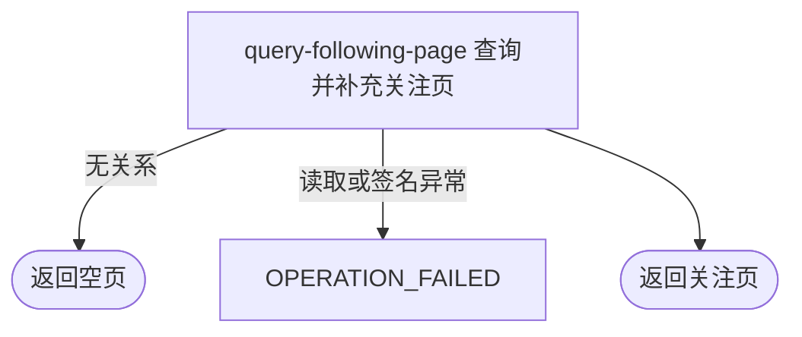

## 概要

分页交付本人或指定用户的关注名单及当前用户关注状态。

## 触发

已登录用户查看本人或指定用户编号正在关注的名单时发起。

## 接口契约

查询参数 `userId`、`lastId` 可省略，`size` 默认 20 且至少为 1。返回 `PageDTO<FollowUserDTO>`：`list`、`hasMore` 有值，`total`、`nextCursor` 为 `null`；每项含 `userId`、昵称、头像地址、NTRP、`isFollowed` 和关系 `cursor`。

## 业务活动

- query-following-page  游标分页查询关注名单并补充资料与当前用户关注状态

## 流程图

## 详细流程

1. 登录后接收可选 `userId`、`lastId` 与 `size`；`size` 默认 20、最小 1、无上限。`userId` 非空白时原样作为名单所属用户，否则取当前用户；不验证指定用户存在。
2. 按 `followerId=名单所属用户` 查询关系；`lastId` 非空白时加 `bizId < lastId`，不校验格式或存在性，按业务编号倒序取 `size+1`。
3. 多取一条判断 `hasMore`，最多返回 `size` 条；`total=null`、`nextCursor=null`，每项 `cursor` 为关系业务编号，调用方用末项继续翻页。
4. 以每条 `followingId` 批量补用户与网球档案；缺资料仍保留用户编号和游标，昵称、头像、NTRP 为空。非空头像键生成 3600 秒签名地址。
5. 按当前登录用户是否关注本页各名单用户设置 `isFollowed`。查询本人关注名单时通常为真，查看他人名单时反映当前用户自己的关系；返回分页对象且不修改数据。

## 异常分支

| 对外失败码 | 触发条件 | 由哪个活动报出 | 补偿动作或超时处理 | 对外提示 |
|---|---|---|---|---|
| 登录相关错误 | 登录凭据缺失、过期或不可验证 | 登录鉴权 | 不查询 | 登录已过期或登录凭证无效，请重新登录 |
| 参数校验错误 | `size < 1` | 入口校验 | 不查询 | size: 每页数量最小为1 |
| `OPERATION_FAILED` | 参数类型错误，或关系/资料读取、头像签名异常 | query-following-page | 终止整体，不返回部分页；不修改数据 | 参数类型错误或系统异常，请稍后重试 |
| 无 | 指定用户不存在、未关注任何人或游标后无记录 | query-following-page | 返回空列表、`hasMore=false` | 查询成功 |

资料缺失的关系不被过滤；保留被关注用户编号、游标与关注状态，其余展示字段为空。`lastId` 无格式/存在性校验，直接参与字符串业务编号的小于比较。

## 技术线索

- HTTP：`GET /user/follow/following?userId=...&lastId=...&size=...`
- 请求：`FollowListCmd`，`size` 默认 20、`@Min(1)`
- 调用：`FollowAppService.getFollowingList()` → `UserFollowDomainService.listFollowing()`
- 查询：`follower_id`、`biz_id < lastId`、`biz_id DESC`、`LIMIT size+1`
- 补充：`UserProfileDomainService.listMap()`、`filterFollowing(UserContext.get(), followingIds)`
- 头像：`QiniuConfiguration.buildSignedUrl()`，3600 秒
