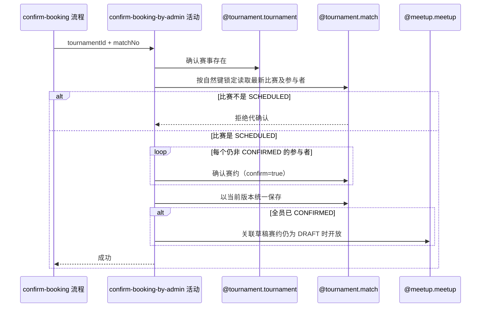

## 概要

按赛事和比赛序号一次性代确认全部未确认参与者赛约，推进比赛并开放草稿赛约。

## 时序图

## 触发条件

运营流程已完成请求字段校验，对由 `tournamentId+matchNo` 唯一指定、状态为 `SCHEDULED` 的一场比赛发起代确认时执行。

## 活动契约

### 入参

| 字段 | 类型 | 必填 | 约束 |
|---|---|---|---|
| `tournamentId` | 字符串 | 是 | 已通过非空校验。 |
| `matchNo` | 整数 | 是 | 正整数。 |

### 成功返回

无业务数据；全部参与者赛约确认状态为 `CONFIRMED`，比赛进入 `PENDING_PLAY`，关联 `DRAFT` 赛约按需改为 `OPEN`。

## 异常分支

| 错误标识 | 触发条件 | 来源 |
|---|---|---|
| `TOURNAMENT_NOT_FOUND` | 指定赛事不存在 | confirm-booking 流程 `TOURNAMENT_NOT_FOUND` 一行 |
| `TOURNAMENT_MATCH_NOT_FOUND` | 指定赛事下不存在该比赛序号 | confirm-booking 流程 `TOURNAMENT_MATCH_NOT_FOUND` 一行 |
| `TOURNAMENT_INVALID_SCHEDULE_CONFIRM` | 比赛不是 `SCHEDULED` | confirm-booking 流程 `TOURNAMENT_INVALID_SCHEDULE_CONFIRM` 一行 |
| `TOURNAMENT_MATCH_VERSION_CONFLICT` | 保存前比赛已被并发修改 | confirm-booking 流程 `TOURNAMENT_MATCH_VERSION_CONFLICT` 一行 |
| `OPERATION_FAILED` | 比赛、参与关系或赛约本次变化未能完整保存 | confirm-booking 流程 `OPERATION_FAILED` 一行 |

## 领域依赖

### @tournament.tournament

- 输入：赛事编号与确认赛事存在的意图。
- 输出：赛事存在时返回赛事身份；不存在时返回失败结论。

### @tournament.match

- 输入：按 `tournamentId+matchNo` 自然键锁定读取最新根及全部参与者的意图；比赛为 `SCHEDULED` 时，对每个赛约确认状态仍非 `CONFIRMED` 的参与者依次发起确认赛约命令（`confirm=true`），最终以当前版本统一保存。
- 输出：正常时返回代确认后各参与者最新确认状态，以及比赛是否已全员确认并进入 `PENDING_PLAY`；异常时给出比赛缺失、状态非 `SCHEDULED` 或版本冲突结论。

### @meetup.meetup

- 输入：比赛已推进为 `PENDING_PLAY` 且关联 `meetupId` 存在时，发起开放赛事草稿赛约的意图。
- 输出：关联赛约为 `DRAFT` 且未过期时改为 `OPEN`；关联缺失、非 `DRAFT` 或因已过期被拒绝时均返回跳过结论，不视为本活动失败。

## 业务动作

- A1 确认指定赛事存在。
- A2 按赛事编号和比赛序号锁定并加载最新比赛聚合及全部参与者，确认比赛为 `SCHEDULED`。
- A3 对每个赛约确认状态仍为 `PENDING` 或 `REJECTED` 的参与者，依次在同一内存聚合上覆盖为 `CONFIRMED` 并刷新确认时间。
- A4 以当前版本统一保存比赛根与全部参与关系；全员确认时比赛进入 `PENDING_PLAY`。
- A5 比赛进入 `PENDING_PLAY` 后，按需把关联草稿赛约开放为 `OPEN`。

## 详细流程

1. `A1` 只确认赛事身份存在，不要求赛事状态。
2. `A2` 按自然键取得比赛根与全部参与者；查不到报比赛不存在；比赛存在但不是 `SCHEDULED` 时拒绝代确认，不修改任何对象。
3. `A3` 逐个覆盖仍非 `CONFIRMED` 的参与者（含历史 `REJECTED`）为 `CONFIRMED` 并记录确认时间；已是 `CONFIRMED` 的参与者保持原状和原确认时间，不参与本次覆盖。
4. `A4` 全部参与者确认状态凑齐为 `CONFIRMED` 后，以版本条件将比赛改为 `PENDING_PLAY`；条件未命中报版本冲突。
5. `A5` 仅在比赛进入 `PENDING_PLAY` 且关联赛约仍为 `DRAFT` 且未过期时开放为 `OPEN`；关联缺失、非 `DRAFT` 或已过期均跳过，不影响本次代确认结果。
6. `A3` 至 `A5` 在同一事务内完成；比赛或参与关系保存失败整体回滚，赛约开放失败不回滚已完成的比赛推进。

## 边界情况

- 比赛为 `SCHEDULED` 但参与者已全部 `CONFIRMED` 时按幂等处理，不重复改写确认时间，不重复开放赛约。
- 参与者列表为空的异常存量数据视为已满足全员确认，直接推进比赛。
- 本活动不选定或变更订场人，不创建或修改赛约的时间、场地、费用。
- 成功只返回 data=null，不发送本活动通知，不记录运营操作人。

## 实现提示

在同一次内存加载的聚合上连续对每个待确认参与者调用确认赛约命令，最终统一以当前 `version` 做一次条件保存，避免多次数据库往返和并发窗口；仓储加载方式与 `tournament.single-match-cancel.activity.delete-cancellable-match` 的自然键锁定读取一致。
