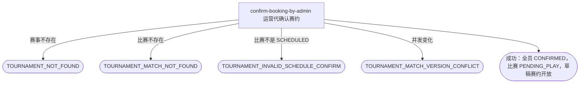

## 概要

让运营在赛约迟迟等不到全员确认时，按赛事和比赛序号一次性代确认并推进比赛。

## 触发

后台运营按赛事编号和比赛序号，对一场卡在待确认赛约的比赛发起代确认；比赛已全部确认时重复请求按幂等处理。

## 接口契约

### 请求参数

| 字段 | 类型 | 必填 | 约束 |
|---|---|---|---|
| `tournamentId` | String | 是 | 非空，必须对应已存在赛事。 |
| `matchNo` | Integer | 是 | 正整数，与 `tournamentId` 共同唯一定位比赛。 |

### 成功响应

无

## 业务活动

- confirm-booking-by-admin  按赛事和比赛序号锁定比赛，将全部仍待确认的参与者一次性改为已确认，全员确认后推进比赛并开放关联草稿赛约

## 流程图

## 详细流程

1. 接收并校验赛事编号和正整数比赛序号，确认赛事存在。
2. 按赛事编号和比赛序号取得最新比赛及全部参与者；比赛不存在时拒绝。
3. 确认比赛正处于待确认赛约；不是则拒绝，不修改任何对象。
4. 将本场比赛全部参与者的赛约确认状态一次性改为已确认并记录确认时间，不论此前是待确认还是已被拒绝；已经是已确认的参与者保持原状和原确认时间。
5. 全部参与者确认状态凑齐为已确认后，将比赛推进为待比赛；比赛没有关联赛约或关联赛约不是草稿时，只推进比赛状态，不处理赛约。
6. 关联赛约仍为草稿时，将其开放。
7. 比赛推进和赛约开放在同一事务内完成；成功后返回无数据响应，不发送通知。

## 异常分支

| 对外失败码 | 触发条件 | 由哪个活动报出 | 补偿动作或超时处理 | 对外提示 |
|---|---|---|---|---|
| 无权限/参数校验错误 | 运营访问无效、`tournamentId` 空白或 `matchNo` 不是正整数 | 流程 | 不读取或修改 | 无权限访问／赛事ID不能为空／比赛序号必须为正整数 |
| `TOURNAMENT_NOT_FOUND` | 指定赛事不存在 | confirm-booking-by-admin | 不修改比赛、参与者和赛约 | 赛事不存在 |
| `TOURNAMENT_MATCH_NOT_FOUND` | 指定赛事下不存在该比赛序号 | confirm-booking-by-admin | 不补建或修改任何对象 | 比赛不存在 |
| `TOURNAMENT_INVALID_SCHEDULE_CONFIRM` | 比赛不是 `SCHEDULED`（例如仍在订场中、已在待比赛、已终止或已完成） | confirm-booking-by-admin | 比赛、参与者和赛约保持原状 | 当前状态不允许确认赛约 |
| `TOURNAMENT_MATCH_VERSION_CONFLICT` | 保存前比赛已被并发修改 | confirm-booking-by-admin | 事务回滚，保留先完成的变化 | 比赛状态已变更，请刷新后重试 |
| `OPERATION_FAILED` | 比赛、参与关系或赛约本次变化未能完整保存 | confirm-booking-by-admin | 事务回滚，不交付部分代确认结果 | 系统异常，请稍后重试 |

## 技术线索

- 新入口：`POST /tournament/admin/match/booking/confirm`
- 请求字段：`tournamentId`、`matchNo`
- 幂等：目标比赛已是 `PENDING_PLAY` 或参与者已全部 `CONFIRMED` 时按幂等处理，不重复改写确认时间或重复开放赛约
- 不新增操作人字段，不区分运营代确认与参赛者本人确认
- 不校验关联赛约是否存在（`meetupId` 是否非空）
