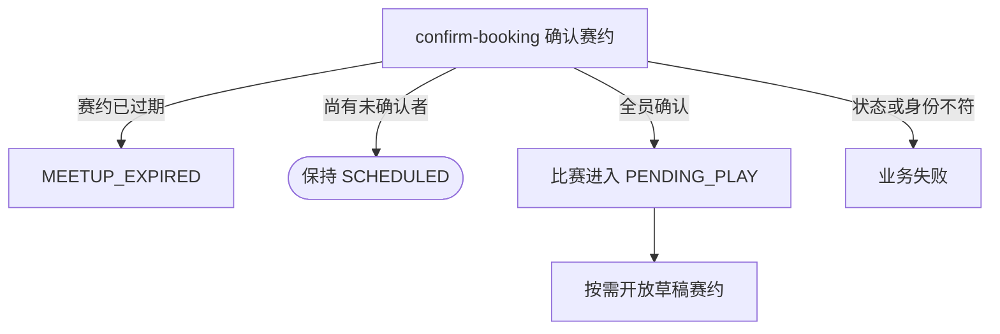

## 概要

记录参赛者接受当前赛约，并在全员确认后让比赛进入待比赛。

## 触发

待确认赛约的比赛参与者接受当前时间与场地安排时，以 `confirm=true` 发起。

## 接口契约

请求体含非空 `matchId` 和 `confirm=true`；本分支不使用 `rejectReason` 或 `rebookReason`。成功返回无数据响应。

## 业务活动

- confirm-booking  记录本人赛约确认并在全员确认时开放比赛

## 流程图

## 详细流程

1. 识别当前登录用户，接收比赛编号与 `confirm=true`。
2. 取得比赛、参与者、所属赛事与本人报名，确认比赛为 `SCHEDULED` 且本人属于参与者。
3. 比赛关联的赛约记录存在时，要求 `startTime` 晚于当前时间；已经开始或结束时拒绝确认。未关联赛约或记录缺失时保留原兼容行为。
4. 将本人赛约确认改为 `CONFIRMED` 并记录当前时间，以版本条件保存比赛与参与关系。
5. 若尚有未确认者，比赛保持 `SCHEDULED`；若全员确认，将比赛改为 `PENDING_PLAY`。
6. 全员确认时，若关联赛约存在且为 `DRAFT`，将其改为 `OPEN`；其他情况不阻止比赛进入待比赛。

## 异常分支

| 对外失败码 | 触发条件 | 由哪个活动报出 | 补偿动作或超时处理 | 对外提示 |
|---|---|---|---|---|
| 未登录/参数校验错误 | 无有效登录，比赛编号空白，或 `confirm` 缺失 | 入口鉴权与校验 | 不修改 | 统一登录提示／比赛ID不能为空／确认状态不能为空 |
| `TOURNAMENT_ENTRY_NOT_FOUND` | 比赛、本人报名不存在，或本人不在参与者中 | confirm-booking | 事务回滚 | 报名记录不存在 |
| `TOURNAMENT_NOT_FOUND` | 所属赛事不存在 | confirm-booking | 事务回滚 | 赛事不存在 |
| `TOURNAMENT_INVALID_SCHEDULE_CONFIRM` | 比赛不是 `SCHEDULED` | confirm-booking | 所有对象不变 | 当前状态不允许确认赛约 |
| `MEETUP_EXPIRED` | 关联赛约的开始时间已经过去 | confirm-booking | 不记录本人确认，不修改比赛、参与关系或赛约 | 约球已开始或已结束，无法操作 |
| 无 | 本人已 `CONFIRMED` 或异常为 `REJECTED` | confirm-booking | 覆盖为 `CONFIRMED` 并刷新时间，继续判断全员 | 确认成功 |
| 无 | 全员确认但赛约编号空、活动不存在或非 `DRAFT` | confirm-booking | 比赛仍进入 `PENDING_PLAY`，不创建/修改活动 | 确认成功 |
| `TOURNAMENT_MATCH_VERSION_CONFLICT` | 比赛被并发修改 | confirm-booking | 事务回滚，保留先保存结果 | 比赛状态已变更，请刷新后重试 |
| `OPERATION_FAILED` | 比赛、参与关系或赛约保存失败 | confirm-booking | 事务回滚，不交付部分确认 | 系统异常，请稍后重试 |

## 技术线索

- HTTP：`POST /tournament/match/schedule-confirm`
- 请求：`ScheduleConfirmCmd`，本流程仅 `confirm=true`
- 调用：`TournamentMatchAppService.confirmSchedule()` → `TournamentMatchFlowService.handleScheduleConfirm()` → `Meetup.assertNotExpired()` → `TournamentMatch.confirmSchedule()` → `activateDraftMeetup()`
- 并发：`TournamentMatchRepository.updateWithVersion()`
- 事务：`@Transactional(rollbackFor = Exception.class)`
