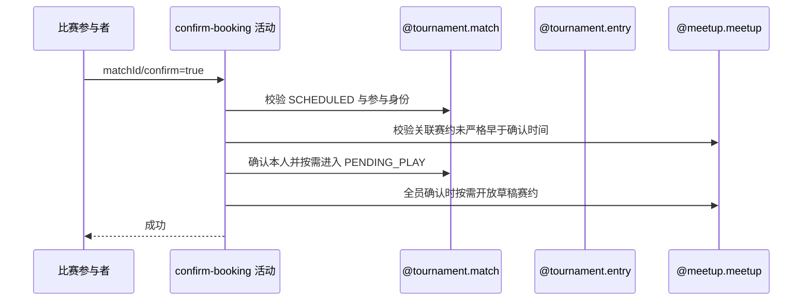

## 概要

记录本人赛约确认，并在全员确认后开放比赛与草稿赛约。

## 时序图

## 触发条件

登录参与者对 SCHEDULED 比赛提交 `confirm=true` 时执行。

## 活动契约

### 入参

| 字段 | 类型 | 必填 | 约束 |
|---|---|---|---|
| `matchId` | 字符串 | 是 | 当前 `SCHEDULED` 比赛编号 |
| `participantUserId` | 字符串 | 是 | 当前登录用户，必须属于比赛参与者 |
| `confirmTime` | 日期时间 | 是 | 本次确认时间，也用于赛约过期判断 |

### 成功返回

无业务数据；本人确认为 `CONFIRMED`，尚有未确认者时比赛保持 `SCHEDULED`，全员确认时比赛进入 `PENDING_PLAY`，关联 `DRAFT` 赛约按需改为 `OPEN`。

## 异常分支

| 错误标识 | 触发条件 | 来源 |
|---|---|---|
| `TOURNAMENT_ENTRY_NOT_FOUND` | 比赛、本人报名不存在或不在参与者中 | confirm-booking 流程 `TOURNAMENT_ENTRY_NOT_FOUND` 一行 |
| `TOURNAMENT_NOT_FOUND` | 所属赛事不存在 | confirm-booking 流程 `TOURNAMENT_NOT_FOUND` 一行 |
| `TOURNAMENT_INVALID_SCHEDULE_CONFIRM` | 比赛不是 `SCHEDULED` | confirm-booking 流程 `TOURNAMENT_INVALID_SCHEDULE_CONFIRM` 一行 |
| `MEETUP_EXPIRED` | 存在的关联赛约开始时间严格早于确认时间 | confirm-booking 流程 `MEETUP_EXPIRED` 一行 |
| `TOURNAMENT_MATCH_VERSION_CONFLICT` | 并发修改比赛 | confirm-booking 流程 `TOURNAMENT_MATCH_VERSION_CONFLICT` 一行 |
| `OPERATION_FAILED` | 比赛、参与关系或赛约保存失败 | confirm-booking 流程 `OPERATION_FAILED` 一行 |

## 领域依赖

### @tournament.match

- 输入：比赛编号、当前参与者、确认时间、关联赛约未过期结论与当前版本。
- 输出：正常时更新本人确认并按全员状态保持 `SCHEDULED` 或进入 `PENDING_PLAY`；异常时给出比赛缺失、状态非法、非参与者或版本冲突结论。

### @tournament.entry

- 输入：所属赛事与当前用户编号，以及核实本人赛事报名存在的意图。
- 输出：正常时返回本人报名身份；异常时给出报名不存在结论。

### @meetup.meetup

- 输入：可选关联赛约编号、确认时间，以及全员确认后按需开放草稿赛约的意图。
- 输出：正常时给出未过期结论并按需把 `DRAFT` 改为 `OPEN`；异常时给出已过期或保存失败结论，关联缺失和非 `DRAFT` 返回无需修改。

## 业务动作

- A1 校验比赛、所属赛事、本人报名与参与身份。
- A2 在关联赛约记录存在时校验其开始时间未严格早于确认时间。
- A3 覆盖本人赛约确认状态并刷新确认时间。
- A4 判定全员确认结果并按版本推进比赛。
- A5 全员确认时按需开放关联草稿赛约。

## 详细流程

1. A1 读取比赛、参与者、所属赛事和本人报名，要求比赛为 `SCHEDULED` 且本人属于参与者。
2. A2 仅在关联赛约记录存在且其开始时间严格早于确认时间时返回 `MEETUP_EXPIRED`；开始时间与确认时间恰等时继续，未关联或记录缺失时兼容放行。
3. A3 本人无论原为 `PENDING`、`CONFIRMED` 或异常 `REJECTED`，均覆盖为 `CONFIRMED` 并刷新确认时间。
4. A4 尚有未确认者时比赛保持 `SCHEDULED`；全员确认时以版本条件改为 `PENDING_PLAY`。
5. A5 全员确认且关联赛约存在并为 `DRAFT` 时改为 `OPEN`；编号空、赛约缺失或非 `DRAFT` 不阻止比赛推进。
6. A3 至 A5 在同一事务保存比赛、参与关系与可变赛约，任一保存失败整体回滚。

## 边界情况

- 重复确认会刷新本人确认时间，并重新判断全员状态。
- 过期校验只作用于 confirm=true；拒赛和申请重订仍允许处理已经开始的赛约。
- 赛约无法满足开放条件时比赛仍可进入 PENDING_PLAY。
- 成功只返回 data=null，不发送本活动通知。

## 实现提示

活动读取关联赛约的 startTime；一致性由 `@tournament.match`、`@tournament.entry` 与 `@meetup.meetup` 协作表达。
