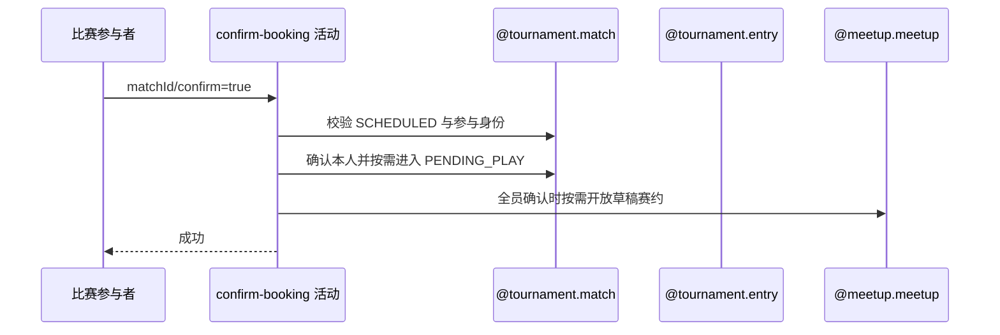

## 概要

记录本人赛约确认，并在全员确认后开放比赛与草稿赛约。

## 时序图

## 触发条件

登录参与者对 SCHEDULED 比赛提交 `confirm=true` 时执行。

## 活动契约

将本人确认状态覆盖为 CONFIRMED 并刷新时间；尚有未确认者保持 SCHEDULED，全员确认则进入 PENDING_PLAY，并尝试把关联 DRAFT 赛约改为 OPEN。

## 异常分支

| 错误标识 | 触发条件 | 处理 |
|---|---|---|
| `TOURNAMENT_ENTRY_NOT_FOUND` | 比赛、本人报名不存在或不在参与者中 | 事务回滚 |
| `TOURNAMENT_NOT_FOUND` | 所属赛事不存在 | 事务回滚 |
| `TOURNAMENT_INVALID_SCHEDULE_CONFIRM` | 比赛不是 SCHEDULED | 不修改 |
| `TOURNAMENT_MATCH_VERSION_CONFLICT` | 并发修改比赛 | 事务回滚，刷新重试 |
| `OPERATION_FAILED` | 比赛、参与关系或赛约保存失败 | 整体回滚，不交付部分确认 |

## 领域依赖

### @tournament.match
- 输入：比赛、当前参与者与版本
- 输出：确认状态及比赛阶段更新

### @tournament.entry
- 输入：本人报名身份
- 输出：参与资格确认

### @meetup.meetup
- 输入：关联 meetupId
- 输出：DRAFT 赛约按需开放

## 业务动作

A1 校验比赛与参与身份
A2 覆盖本人确认状态
A3 判定全员确认并推进比赛
A4 按需开放草稿赛约

## 详细流程

1. 读取比赛、参与者、所属赛事和本人报名，要求比赛为 SCHEDULED 且本人属于参与者。
2. 本人无论原为 PENDING、CONFIRMED 或异常 REJECTED，均覆盖为 CONFIRMED 并刷新确认时间。
3. 尚有未确认者时比赛保持 SCHEDULED；全员确认时改为 PENDING_PLAY。
4. 全员确认且关联赛约存在并为 DRAFT 时改为 OPEN；编号空、赛约缺失或非 DRAFT 不阻止比赛推进。
5. 以比赛版本条件在同一事务保存比赛、参与关系与可变赛约，失败整体回滚。

## 边界情况

- 重复确认会刷新本人确认时间，并重新判断全员状态。
- 赛约无法满足开放条件时比赛仍可进入 PENDING_PLAY。
- 成功只返回 data=null，不发送本活动通知。

## 实现提示

写活动 `reads` 为空；一致性由 `@tournament.match`、`@tournament.entry` 与 `@meetup.meetup` 协作表达。
