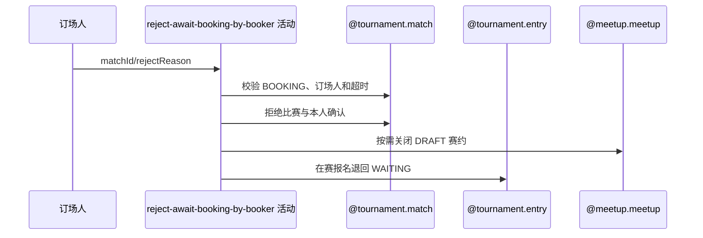

## 概要

订场人在订场等待超时后终止比赛并释放报名。

## 时序图

## 触发条件

BOOKING 比赛的当前订场人在本轮等待期限届满后发起。

## 活动契约

以订场人选定时间与最近重订时间较晚者为起点；超时后拒绝比赛、关闭仍为 DRAFT 的赛约并把在赛报名退回 WAITING。

## 异常分支

| 错误标识 | 触发条件 | 处理 |
|---|---|---|
| `TOURNAMENT_ENTRY_NOT_FOUND` | 比赛不存在或本人不在参与者中 | 回滚 |
| `TOURNAMENT_BOOKING_REJECT_FORBIDDEN`/`TOURNAMENT_NOT_COURT_BOOKER` | 阶段或订场人身份不符 | 不修改 |
| `TOURNAMENT_MATCH_REJECT_TOO_EARLY` | 起点缺失或未到期 | 不修改，到期后重试 |
| `TOURNAMENT_MATCH_VERSION_CONFLICT`/`OPERATION_FAILED` | 并发或保存失败 | 整体回滚 |

## 领域依赖

### @tournament.match
- 输入：BOOKING 比赛、订场人、理由与版本
- 输出：REJECTED 比赛及参与确认
### @tournament.entry
- 输入：仍在本场比赛的报名
- 输出：退回 WAITING
### @meetup.meetup
- 输入：关联 meetupId
- 输出：仅 DRAFT 时关闭

## 业务动作

A1 校验订场人与等待期限
A2 拒绝比赛和本人确认
A3 关闭草稿赛约
A4 释放在赛报名
A5 提交后通知

## 详细流程

1. 要求比赛为 BOOKING、本人属于参与者且等于 courtBookerId。
2. 取 courtBookerSelectedTime 与 latestRebookTime 较晚者为起点，按配置超时（缺省 48 小时）校验。
3. 本人确认改为 REJECTED 并记时间，比赛改为 REJECTED 并记录理由。
4. 仅关闭仍为 DRAFT 的关联赛约；把仍在本比赛中的报名退回 WAITING。
5. 比赛按版本条件与其他变更同事务保存；提交后异步通知且内部容错。

## 边界情况

- 重订会把等待起点推迟到最近重订时间。
- 赛约缺失或非 DRAFT 不阻止拒赛。
- 通知失败不回滚已提交拒赛。

## 实现提示

写活动 `reads` 为空；三个聚合在同一应用事务协作。
