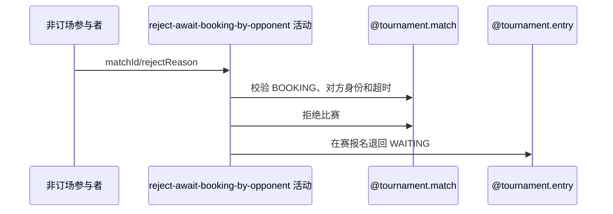

## 概要

非订场方在订场等待超时后终止比赛并释放报名。

## 时序图

## 触发条件

BOOKING 比赛已选订场人，非订场参与者在等待期限届满后发起。

## 活动契约

以订场人选定时间与最近重订时间较晚者为起点；超时后拒绝比赛、按需关闭草稿赛约并释放在赛报名。

## 异常分支

| 错误标识 | 触发条件 | 处理 |
|---|---|---|
| `TOURNAMENT_ENTRY_NOT_FOUND` | 比赛不存在或本人不在参与者中 | 回滚 |
| `TOURNAMENT_WAITING_BOOKING_REJECT_FORBIDDEN` | 非 BOOKING、未选订场人或本人是订场人 | 不修改 |
| `TOURNAMENT_MATCH_REJECT_TOO_EARLY` | 起点缺失或未到期 | 不修改，到期后重试 |
| `TOURNAMENT_MATCH_VERSION_CONFLICT`/`OPERATION_FAILED` | 并发或保存失败 | 整体回滚 |

## 领域依赖

### @tournament.match
- 输入：比赛、非订场参与者、理由与版本
- 输出：REJECTED 比赛及参与确认
### @tournament.entry
- 输入：在赛报名
- 输出：退回 WAITING
### @meetup.meetup
- 输入：关联草稿赛约
- 输出：按需关闭

## 业务动作

A1 校验非订场方与等待期限
A2 拒绝比赛和本人确认
A3 关闭草稿赛约并释放报名
A4 提交后通知

## 详细流程

1. 要求比赛为 BOOKING、已有 courtBookerId、本人属于参与者且不是订场人。
2. 取订场人选定时间与最近重订时间较晚者，按配置超时（缺省 48 小时）校验。
3. 本人确认改为 REJECTED 并记时间，比赛改为 REJECTED 并记录理由。
4. 仅关闭 DRAFT 关联赛约，把仍在比赛中的报名退回 WAITING。
5. 比赛版本更新及关联变更同事务；提交后异步通知且内部容错。

## 边界情况

- 订场人不能使用本活动，应走订场人超时拒绝。
- 赛约缺失或非 DRAFT 不阻止拒赛。
- 通知失败不回滚。

## 实现提示

写活动 `reads` 为空；等待起点与订场人路径一致。
