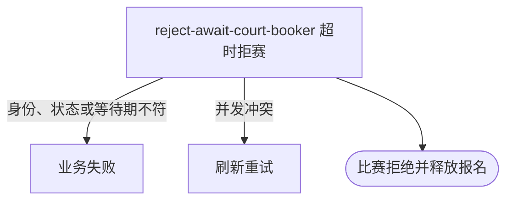

## 概要

让已匹配比赛的参与者在订场人迟迟未选定时，超时拒绝比赛并回到待匹配池。

## 触发

比赛已匹配但迟迟未选出订场人，任一比赛参与者在等待期届满后发起拒赛。

## 接口契约

请求体含非空 `matchId` 和非空 `rejectReason`。拒赛理由须为系统支持的枚举值；成功返回无数据响应。

## 业务活动

- reject-await-court-booker  超时拒绝待选订场人的比赛

## 流程图

## 详细流程

1. 识别当前登录用户，接收比赛编号和拒赛理由。
2. 取得比赛及参与者，确认比赛仍为 `MATCHED` 且本人属于该场比赛。
3. 以比赛匹配时间为起点，确认当前时间已达到系统配置的拒赛等待期限。
4. 将本人确认状态改为 `REJECTED` 并记录确认时间，将比赛改为 `REJECTED` 并记录拒赛理由。
5. 以版本条件保存比赛及参与关系；若关联的是仍处于草稿状态的线下赛约则关闭该赛约，并将仍在比赛中的报名退回 `WAITING`。
6. 事务提交后异步通知相关人员，返回拒赛成功。

## 异常分支

| 对外失败码 | 触发条件 | 由哪个活动报出 | 补偿动作或超时处理 | 对外提示 |
|---|---|---|---|---|
| 未登录/参数校验错误 | 无有效登录，比赛编号空白或拒赛理由缺失 | 入口鉴权与校验 | 不读取/修改 | 统一登录提示／比赛ID不能为空／拒绝理由不能为空 |
| 请求参数无效 | `rejectReason` 不是受支持枚举 | 参数反序列化 | 不读取/修改 | 请求参数无效 |
| `TOURNAMENT_ENTRY_NOT_FOUND` | 比赛不存在或本人不在参与者中 | reject-await-court-booker | 事务回滚 | 报名记录不存在 |
| `TOURNAMENT_NO_BOOKER_REJECT_FORBIDDEN` | 比赛不是 `MATCHED` | reject-await-court-booker | 所有对象不变 | 当前不是待选订场人阶段 |
| `TOURNAMENT_MATCH_REJECT_TOO_EARLY` | 匹配时间缺失或等待期限尚未届满 | reject-await-court-booker | 不修改；到期后可重试 | 等待超时后可拒绝 |
| `TOURNAMENT_MATCH_VERSION_CONFLICT` | 比赛已被并发修改 | reject-await-court-booker | 事务回滚，保留先保存结果 | 比赛状态已变更，请刷新后重试 |
| `OPERATION_FAILED` | 比赛、参与关系、报名或赛约未完整保存 | reject-await-court-booker | 事务回滚，不交付部分拒赛 | 系统异常，请稍后重试 |

## 技术线索

- HTTP：`POST /tournament/match/reject-on-await-court-booker-select`
- 请求：`RejectMatchCmd`
- 调用：`TournamentMatchAppService.rejectOnAwaitCourtBookerSelect()` → `TournamentMatchFlowService.rejectOnAwaitCourtBookerSelect()` → `TournamentMatch.rejectOnAwaitCourtBookerSelect()`
- 超时配置：`SystemConfigKey.TOURNAMENT_MATCH_REJECT_TIMEOUT_HOURS`，缺省 48 小时
- 并发：`TournamentMatchRepository.updateWithVersion()`
- 事务：`@Transactional(rollbackFor = Exception.class)`；通知在提交后异步执行并内部容错
