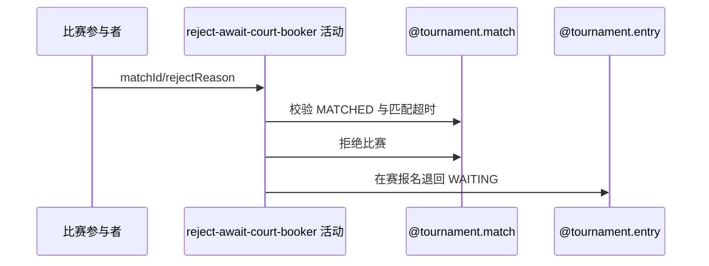

## 概要

参与者在订场人选定超时后拒绝比赛并回到匹配池。

## 时序图

## 触发条件

MATCHED 比赛尚待选订场人，参与者在匹配等待期限届满后发起。

## 活动契约

以 matchedTime 为等待起点；超时后拒绝比赛、按需关闭草稿赛约并将仍在比赛中的报名退回 WAITING。

## 异常分支

| 错误标识 | 触发条件 | 处理 |
|---|---|---|
| `TOURNAMENT_ENTRY_NOT_FOUND` | 比赛不存在或本人不在参与者中 | 回滚 |
| `TOURNAMENT_NO_BOOKER_REJECT_FORBIDDEN` | 比赛不是 MATCHED | 不修改 |
| `TOURNAMENT_MATCH_REJECT_TOO_EARLY` | matchedTime 缺失或未到期 | 不修改，到期后重试 |
| `TOURNAMENT_MATCH_VERSION_CONFLICT`/`OPERATION_FAILED` | 并发或保存失败 | 整体回滚 |

## 领域依赖

### @tournament.match
- 输入：MATCHED 比赛、参与者、理由与版本
- 输出：REJECTED 比赛
### @tournament.entry
- 输入：在赛报名
- 输出：退回 WAITING
### @meetup.meetup
- 输入：关联草稿赛约
- 输出：按需关闭

## 业务动作

A1 校验参与身份与匹配超时
A2 拒绝比赛和本人确认
A3 关闭草稿赛约并释放报名
A4 提交后通知

## 详细流程

1. 要求比赛为 MATCHED 且本人属于参与者，不要求已选订场人。
2. 以 matchedTime 为起点，按配置超时（缺省 48 小时）判断；起点缺失同样拒绝操作。
3. 本人确认和比赛均改为 REJECTED，记录时间与拒绝理由。
4. 仅关闭 DRAFT 关联赛约，把仍在本比赛中的报名退回 WAITING。
5. 版本更新与关联变更同事务；提交后异步通知且内部容错。

## 边界情况

- 任一参与者都可在超时后发起。
- 释放报名使参赛者重新进入当前轮匹配池。
- 通知不属于事务成功条件。

## 实现提示

写活动 `reads` 为空；等待起点不同于 BOOKING 阶段。
