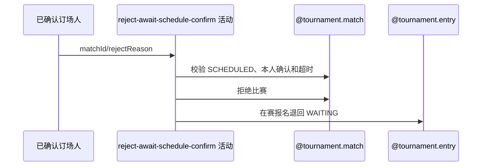

## 概要

订场人在对方确认超时后终止比赛并释放报名。

## 时序图

## 触发条件

SCHEDULED 比赛的订场人已确认，对方超过赛约确认期限仍未确认时执行。

## 活动契约

以 scheduleSubmittedTime 为起点；超时后拒绝比赛、按需关闭草稿赛约并将仍在比赛中的报名退回 WAITING。

## 异常分支

| 错误标识 | 触发条件 | 处理 |
|---|---|---|
| `TOURNAMENT_ENTRY_NOT_FOUND` | 比赛不存在或本人不在参与者中 | 回滚 |
| `TOURNAMENT_WAITING_SCHEDULE_CONFIRM_REJECT_FORBIDDEN` | 非 SCHEDULED、本人非订场人或本人未确认 | 不修改 |
| `TOURNAMENT_MATCH_REJECT_TOO_EARLY` | 提交时间缺失或未到期 | 不修改，到期后重试 |
| `TOURNAMENT_MATCH_VERSION_CONFLICT`/`OPERATION_FAILED` | 并发或保存失败 | 整体回滚 |

## 领域依赖

### @tournament.match
- 输入：SCHEDULED 比赛、已确认订场人、理由与版本
- 输出：REJECTED 比赛
### @tournament.entry
- 输入：在赛报名
- 输出：退回 WAITING
### @meetup.meetup
- 输入：关联草稿赛约
- 输出：按需关闭

## 业务动作

A1 校验订场人确认与等待期限
A2 拒绝比赛和本人确认
A3 关闭草稿赛约并释放报名
A4 提交后通知

## 详细流程

1. 要求比赛为 SCHEDULED、本人属于参与者、等于订场人且本人 confirmationStatus=CONFIRMED。
2. 以 scheduleSubmittedTime 为起点按配置超时（缺省 48 小时）判断。
3. 本人确认改为 REJECTED，比赛改为 REJECTED 并记录理由。
4. 仅关闭 DRAFT 关联赛约，把仍在本比赛中的报名退回 WAITING。
5. 版本更新与关联变更同事务；提交后异步通知且内部容错。

## 边界情况

- 非订场方不能使用本活动。
- 订场人虽已确认，拒绝时自身确认仍改为 REJECTED。
- 关联赛约通常为 DRAFT；其他状态不阻止拒赛。

## 实现提示

写活动 `reads` 为空；超时起点固定为原赛约提交时间。
