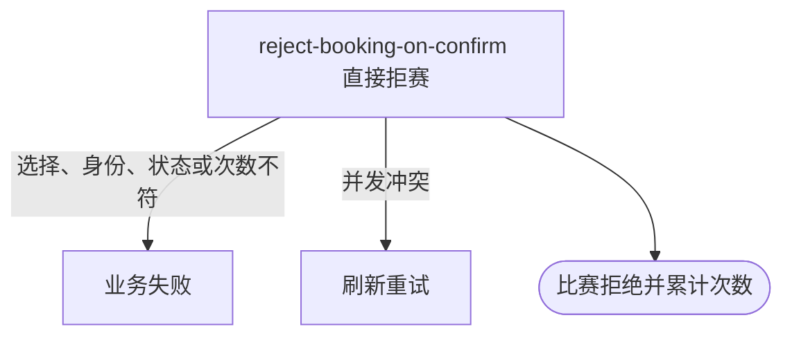

## 概要

让比赛参与者在确认赛约时直接拒赛，并按当前赛段累计本人拒赛次数。

## 触发

比赛参与者查看已提交赛约后决定不再继续比赛，在确认入口选择拒赛。

## 接口契约

请求体含非空 `matchId`、`confirm=false`、一个 `rejectReason` 且 `rebookReason=null`。拒赛理由须为系统支持的枚举值；成功返回无数据响应。

## 业务活动

- reject-booking-on-confirm  拒绝赛约并累计赛段拒赛次数

## 流程图

## 详细流程

1. 识别当前登录用户，接收比赛编号、`confirm=false`、拒赛理由，且不接收重订理由。
2. 取得比赛、参与者、所属赛事和本人报名，确认比赛为 `SCHEDULED` 且本人属于该场比赛。
3. 按报名当前赛段检查本人拒赛次数尚未达到赛事设置的资格赛或正赛上限。
4. 将本人确认状态改为 `REJECTED` 并记录确认时间，将比赛改为 `REJECTED` 并记录拒赛理由，同时递增本人当前赛段拒赛次数。
5. 以版本条件保存比赛、参与关系和报名；仅关闭仍为草稿的关联赛约，并将仍在比赛中的其他报名退回 `WAITING`。
6. 事务提交后异步通知相关人员，返回拒赛成功。

## 异常分支

| 对外失败码 | 触发条件 | 由哪个活动报出 | 补偿动作或超时处理 | 对外提示 |
|---|---|---|---|---|
| 未登录/参数校验错误 | 无有效登录，比赛编号空白或 `confirm` 缺失 | 入口鉴权与校验 | 不读取/修改 | 统一登录提示／比赛ID不能为空／确认状态不能为空 |
| `TOURNAMENT_INVALID_REJECT_REASON` | `confirm=false` 时拒赛理由和重订理由不是恰有一个 | reject-booking-on-confirm | 事务回滚 | 无效的拒绝理由 |
| 请求参数无效 | `rejectReason` 不是受支持枚举 | 参数反序列化 | 不读取/修改 | 请求参数无效 |
| `TOURNAMENT_ENTRY_NOT_FOUND` | 比赛、本人报名不存在，或本人不在参与者中 | reject-booking-on-confirm | 事务回滚 | 报名记录不存在 |
| `TOURNAMENT_NOT_FOUND` | 所属赛事不存在 | reject-booking-on-confirm | 事务回滚 | 赛事不存在 |
| `TOURNAMENT_INVALID_SCHEDULE_CONFIRM` | 比赛不是 `SCHEDULED` | reject-booking-on-confirm | 所有对象不变 | 当前状态不允许确认赛约 |
| `TOURNAMENT_REJECT_LIMIT_REACHED` | 本人当前赛段拒赛次数已达到赛事上限 | reject-booking-on-confirm | 不修改比赛、参与关系和次数 | 已达到当前赛段拒赛次数上限 |
| `TOURNAMENT_MATCH_VERSION_CONFLICT` | 比赛已被并发修改 | reject-booking-on-confirm | 事务回滚，保留先保存结果 | 比赛状态已变更，请刷新后重试 |
| `OPERATION_FAILED` | 比赛、参与关系、报名或赛约未完整保存 | reject-booking-on-confirm | 事务回滚，不交付部分拒赛 | 系统异常，请稍后重试 |

## 技术线索

- HTTP：`POST /tournament/match/schedule-confirm`
- 请求：`ScheduleConfirmCmd`，本流程为 `confirm=false, rejectReason!=null, rebookReason=null`
- 调用：`TournamentMatchAppService.confirmSchedule()` → `TournamentMatchFlowService.handleScheduleConfirm()` → `TournamentMatch.confirmSchedule()`
- 拒赛限额：赛事 `qualifierRejectLimit`／`mainDrawRejectLimit` 与报名对应赛段计数
- 并发：`TournamentMatchRepository.updateWithVersion()`
- 事务：`@Transactional(rollbackFor = Exception.class)`；通知在提交后异步执行并内部容错
