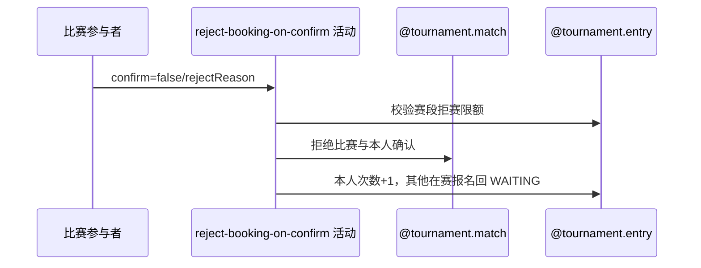

## 概要

确认赛约时直接拒赛，并累计本人当前赛段拒赛次数。

## 时序图

## 触发条件

SCHEDULED 比赛参与者提交 `confirm=false`、仅一个 rejectReason 时执行。

## 活动契约

在本人当前资格赛或正赛拒赛上限内，将比赛和本人确认改为 REJECTED，递增本人对应赛段次数，并释放仍在比赛中的其他报名。

## 异常分支

| 错误标识 | 触发条件 | 处理 |
|---|---|---|
| `TOURNAMENT_INVALID_REJECT_REASON` | 拒赛与重订理由不是恰有一个 | 回滚 |
| `TOURNAMENT_ENTRY_NOT_FOUND`/`TOURNAMENT_NOT_FOUND` | 比赛、报名、参与身份或赛事缺失 | 回滚 |
| `TOURNAMENT_INVALID_SCHEDULE_CONFIRM` | 比赛不是 SCHEDULED | 不修改 |
| `TOURNAMENT_REJECT_LIMIT_REACHED` | 当前赛段次数已达上限 | 不修改 |
| `TOURNAMENT_MATCH_VERSION_CONFLICT`/`OPERATION_FAILED` | 并发或保存失败 | 整体回滚 |

## 领域依赖

### @tournament.match
- 输入：SCHEDULED 比赛、参与者、理由与版本
- 输出：REJECTED 比赛与参与确认
### @tournament.entry
- 输入：本人赛段、拒赛计数及其他在赛报名
- 输出：本人次数递增、其他报名退回 WAITING
### @meetup.meetup
- 输入：关联草稿赛约
- 输出：按需关闭

## 业务动作

A1 校验拒赛选择与参与身份
A2 校验当前赛段限额
A3 拒绝比赛并累计本人次数
A4 关闭草稿赛约并释放其他报名
A5 提交后通知

## 详细流程

1. 要求 confirm=false、rejectReason 非空且 rebookReason 为空；比赛为 SCHEDULED 且本人属于参与者。
2. 依本人报名当前赛段选择 qualifierRejectLimit 或 mainDrawRejectLimit，达到上限即拒绝操作。
3. 本人确认与比赛改为 REJECTED，记录理由；本人对应赛段 rejectCount 加一。
4. 仅关闭 DRAFT 关联赛约；仍在比赛中的其他报名退回 WAITING，本人报名保留计数语义。
5. 比赛版本更新、参与关系、报名和赛约同事务；提交后异步通知且容错。

## 边界情况

- 限额按报名当前赛段分别累计，不共享资格赛与正赛计数。
- 本人已确认也可在合法 SCHEDULED 状态改为拒绝。
- 通知失败不回滚拒赛和计数。

## 实现提示

写活动 `reads` 为空；限额来自赛事配置，由聚合协作校验。
