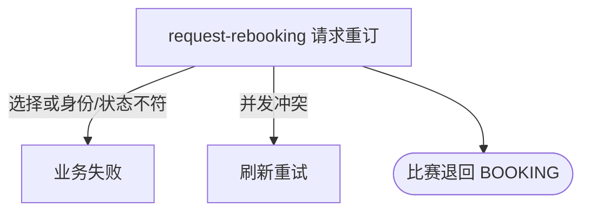

## 概要

让比赛参与者打回待确认赛约，保留订场人与原赛约并要求重订。

## 触发

待确认赛约的任一比赛参与者认为时间、地点或时长需重新安排时发起。

## 接口契约

请求体含非空 `matchId`、`confirm=false`、一个 `rebookReason` 且 `rejectReason=null`。重订理由为 `TIME_NOT_SUITABLE`、`PLACE_NOT_SUITABLE` 或 `DURATION_NOT_SUITABLE`。成功返回无数据响应。

## 业务活动

- request-rebooking  打回当前赛约并重置全员确认状态

## 流程图

## 详细流程

1. 识别当前登录用户，接收比赛编号、`confirm=false`、一个重订理由且不提供拒赛理由。
2. 取得比赛、参与者、所属赛事与本人报名，确认比赛为 `SCHEDULED` 且本人属于参与者。
3. 将比赛退回 `BOOKING`，保留订场人、原赛约关联和原提交时间，覆盖记录最近重订请求人、理由和时间。
4. 将全部参与者的赛约确认改为 `PENDING` 并清空确认时间，以版本条件事务性保存。
5. 返回重订成功；订场人后续通过赛约提交服务修改并重新提交。

## 异常分支

| 对外失败码 | 触发条件 | 由哪个活动报出 | 补偿动作或超时处理 | 对外提示 |
|---|---|---|---|---|
| 未登录/参数校验错误 | 无有效登录，比赛编号空白，或 `confirm` 缺失 | 入口鉴权与校验 | 不修改 | 统一登录提示／比赛ID不能为空／确认状态不能为空 |
| `TOURNAMENT_INVALID_REJECT_REASON` | `confirm=false` 时拒赛理由和重订理由不是恰有一个 | request-rebooking | 事务回滚 | 无效的拒绝理由 |
| 请求参数无效 | `rebookReason` 不是受支持枚举 | 参数反序列化 | 不读取/修改 | 请求参数无效 |
| `TOURNAMENT_ENTRY_NOT_FOUND` | 比赛、本人报名不存在，或本人不在参与者中 | request-rebooking | 事务回滚 | 报名记录不存在 |
| `TOURNAMENT_NOT_FOUND` | 所属赛事不存在 | request-rebooking | 事务回滚 | 赛事不存在 |
| `TOURNAMENT_INVALID_SCHEDULE_CONFIRM` | 比赛不是 `SCHEDULED` | request-rebooking | 所有对象不变 | 当前状态不允许确认赛约 |
| `TOURNAMENT_MATCH_VERSION_CONFLICT` | 比赛已被并发修改 | request-rebooking | 事务回滚，保留先保存结果 | 比赛状态已变更，请刷新后重试 |
| `OPERATION_FAILED` | 比赛或参与关系未完整保存 | request-rebooking | 事务回滚，不交付部分重订 | 系统异常，请稍后重试 |

## 技术线索

- HTTP：`POST /tournament/match/schedule-confirm`
- 请求：`ScheduleConfirmCmd`，本流程为 `confirm=false, rebookReason!=null, rejectReason=null`
- 调用：`TournamentMatchAppService.confirmSchedule()` → `TournamentMatchFlowService.handleScheduleConfirm()` → `TournamentMatch.confirmSchedule()`
- 并发：`TournamentMatchRepository.updateWithVersion()`
- 事务：`@Transactional(rollbackFor = Exception.class)`
