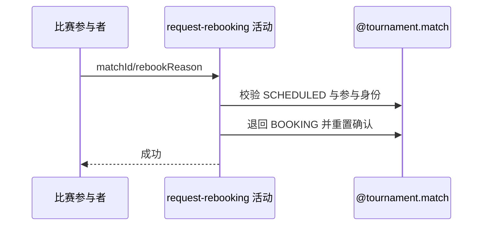

## 概要

打回当前赛约，并重置全员确认状态等待订场人重订。

## 时序图

## 触发条件

登录参与者在确认入口提交 `confirm=false`、仅一个 rebookReason 时执行。

## 活动契约

把 SCHEDULED 比赛退回 BOOKING，保留订场人、原赛约和原提交时间，记录最新重订请求，并将全部参与者重置为 PENDING。

## 异常分支

| 错误标识 | 触发条件 | 处理 |
|---|---|---|
| `TOURNAMENT_INVALID_REJECT_REASON` | 拒赛与重订理由不是恰有一个 | 事务回滚 |
| `TOURNAMENT_ENTRY_NOT_FOUND`/`TOURNAMENT_NOT_FOUND` | 比赛、报名、参与身份或赛事缺失 | 事务回滚 |
| `TOURNAMENT_INVALID_SCHEDULE_CONFIRM` | 比赛不是 SCHEDULED | 不修改 |
| `TOURNAMENT_MATCH_VERSION_CONFLICT` | 并发修改比赛 | 事务回滚，刷新重试 |
| `OPERATION_FAILED` | 比赛或参与关系保存不完整 | 整体回滚 |

## 领域依赖

### @tournament.match

- 输入：比赛、请求参与者、重订理由与版本
- 输出：BOOKING 状态及重置后的参与确认

## 业务动作

A1 校验重订选择与参与资格
A2 记录最近重订请求
A3 退回 BOOKING
A4 重置全员确认

## 详细流程

1. 要求 confirm=false、rebookReason 非空且 rejectReason 为空，并确认比赛为 SCHEDULED、本人属于参与者。
2. 比赛退回 BOOKING，但保留原 courtBookerId、meetupId 与 scheduleSubmittedTime。
3. 覆盖 latestRebookRequester、reason 和 time，作为新一轮订场等待起点的一部分。
4. 全部参与者 confirmationStatus 改为 PENDING，confirmationTime 清空。
5. 以版本条件在同一事务保存比赛与参与关系，后续由订场人修改并重新提交原赛约。

## 边界情况

- 任一参与者均可请求重订，不限订场人或未确认者。
- 多次重订只保留最近一次请求信息。
- 原赛约不关闭、不清除，比赛提交时间也不重置。

## 实现提示

写入使用 `@tournament.match`，`reads` 为空；重订理由枚举由入口反序列化。
