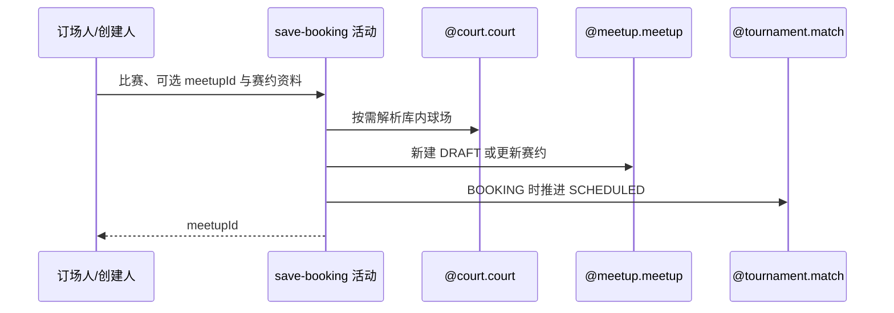

## 概要

新建或更新赛约，并按需推进比赛进入赛约确认。

## 时序图

## 触发条件

登录订场人首次提交/重订赛约，或赛约创建人在 SCHEDULED 阶段修改当前赛约时执行。

## 活动契约

未传 meetupId 时在 BOOKING 新建 DRAFT 赛约；传入时校验当前关联和创建人后更新。BOOKING 提交推进 SCHEDULED 并重置确认，SCHEDULED 内修改保留确认状态。

## 异常分支

| 错误标识 | 触发条件 | 处理 |
|---|---|---|
| `TOURNAMENT_ENTRY_NOT_FOUND`/`TOURNAMENT_NOT_FOUND` | 比赛或实际赛事不存在 | 不写入 |
| `TOURNAMENT_INVALID_SCHEDULE_CONFIRM`/`TOURNAMENT_NOT_COURT_BOOKER` | 新建时阶段或订场人不符 | 不创建、不推进 |
| `MEETUP_NOT_FOUND`/`TOURNAMENT_BOOKING_MEETUP_MISMATCH`/`NOT_CREATOR` | 更新目标、关联或创建人不符 | 不修改 |
| `MEETUP_TOURNAMENT_EDIT_FORBIDDEN` | 更新时非 BOOKING/SCHEDULED | 不修改 |
| `TOURNAMENT_MATCH_VERSION_CONFLICT` | BOOKING 推进时并发冲突 | 事务回滚 |
| `OPERATION_FAILED` | 赛约、比赛或参与关系保存失败 | 整体回滚，不返回编号 |

## 领域依赖

### @court.court
- 输入：TEXT/MAP courtId
- 输出：可选库内场地资料

### @meetup.meetup
- 输入：赛约资料、创建人及比赛参与者
- 输出：新建或更新赛约

### @tournament.match
- 输入：比赛、订场人与当前版本
- 输出：赛约关联及阶段/确认状态

## 业务动作

A1 校验比赛、赛事和操作者
A2 解析请求或库内场地
A3 新建或更新赛约
A4 按需推进比赛确认
A5 提交后尝试通知

## 详细流程

1. 读取比赛、参与者与比赛实际所属赛事；请求 tournamentId 不替代实际归属。TEXT/MAP 且 courtId 命中时采用库内场地，否则使用请求资料。
2. meetupId 为空时要求比赛 BOOKING 且本人为订场人，新建 DRAFT 赛约并把全部比赛参与者保存为 JOINED。
3. meetupId 非空时要求赛约存在、与比赛当前关联一致、本人为创建人，比赛为 BOOKING 或 SCHEDULED，然后更新资料。
4. BOOKING 提交时比赛进入 SCHEDULED、记录提交时间，订场人 CONFIRMED、其他人 PENDING；SCHEDULED 内更新不重置现有确认状态。
5. 同一事务保存赛约、比赛和参与关系。只有 BOOKING→SCHEDULED 使用比赛版本条件；SCHEDULED 内修改不比较比赛版本。
6. 提交后向其他参与者异步尝试订场通知；无额度或发送失败不影响成功，返回赛约 bizId。

## 边界情况

- courtId 查不到时不是错误，降级采用请求场地文本/坐标。
- SCHEDULED 内修改可发生在部分参与者已确认之后，确认状态保持。
- 通知在事务提交后且内部容错，不属于成功一致性条件。

## 实现提示

写活动 `reads` 为空；使用已确认 `@court.court` 及待设计的 `@meetup.meetup`、`@tournament.match`。
